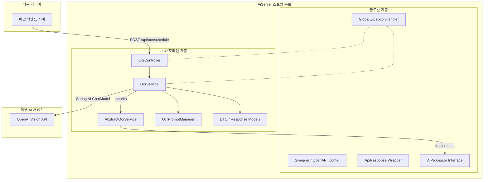
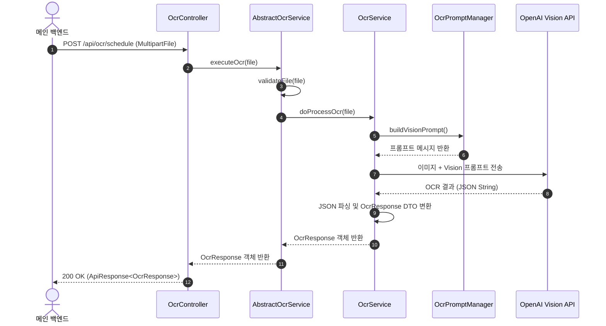

# AiServer 코드 아키텍처 및 베이스 코드 패턴

## 1. 아키텍처 다이어그램 (Mermaid Diagrams)

### 1.1 시스템 구성 다이어그램 (Component Diagram)


### 1.2 데이터 처리 흐름 (Sequence Diagram)


---

## 2. 공통 추상화 및 베이스 패턴 (Base & Generic Architecture)

### 2.1 공통 응답 객체 (`global.common.ApiResponse<T>`)
모든 도메인의 응답을 통일된 JSON 구조로 래핑하여 프론트엔드 및 백엔드와의 계약을 일관되게 유지합니다.

```java
package com.likeLion.backend.aiserver.global.common;

public record ApiResponse<T>(
    boolean success,
    T data,
    String message
) {
    public static <T> ApiResponse<T> success(T data) {
        return new ApiResponse<>(true, data, null);
    }

    public static <T> ApiResponse<T> fail(String message) {
        return new ApiResponse<>(false, null, message);
    }
}
```

### 2.2 AI 처리 공통 인터페이스 (`global.common.AiProcessor<REQ, RES>`)
새로운 AI 도메인(STT, 요약, 번역 등)이 확장되어도 동일한 처리 계약(Contract)을 유지할 수 있도록 제네릭 인터페이스로 정의합니다.

```java
package com.likeLion.backend.aiserver.global.common;

public interface AiProcessor<REQ, RES> {
    RES process(REQ request);
}
```

### 2.3 템플릿 메서드 패턴 추상 클래스 (`domain.ocr.service.AbstractOcrService`)
이미지 유효성 검사, 공통 로깅 등의 공통 순서를 제어하고, 구체적인 AI 모델 호출만 하위 클래스가 오버라이딩하도록 합니다.

```java
package com.likeLion.backend.aiserver.domain.ocr.service;

import com.likeLion.backend.aiserver.global.common.AiProcessor;
import org.springframework.web.multipart.MultipartFile;

public abstract class AbstractOcrService<RES> implements AiProcessor<MultipartFile, RES> {

    @Override
    public RES process(MultipartFile file) {
        validateFile(file); // 1. 공통 파일 검증
        return doProcessOcr(file); // 2. 각 도메인별 구체적 OCR 로직 수행
    }

    protected void validateFile(MultipartFile file) {
        if (file == null || file.isEmpty()) {
            throw new IllegalArgumentException("업로드된 파일이 비어있습니다.");
        }
    }

    protected abstract RES doProcessOcr(MultipartFile file);
}
```

---

## 3. 계층별 표준 베이스 코드 패턴 (Base Code Patterns)

### 3.1 Controller Layer 패턴 (`OcrController.java`)
```java
package com.likeLion.backend.aiserver.domain.ocr.controller;

import com.likeLion.backend.aiserver.domain.ocr.dto.OcrResponse;
import com.likeLion.backend.aiserver.domain.ocr.service.OcrService;
import com.likeLion.backend.aiserver.global.common.ApiResponse;
import org.springframework.http.ResponseEntity;
import org.springframework.web.bind.annotation.*;
import org.springframework.web.multipart.MultipartFile;

@RestController
@RequestMapping("/api/ocr")
public class OcrController {

    private final OcrService ocrService;

    public OcrController(OcrService ocrService) {
        this.ocrService = ocrService;
    }

    @PostMapping("/schedule")
    public ResponseEntity<ApiResponse<OcrResponse>> processScheduleOcr(@RequestParam("file") MultipartFile file) {
        OcrResponse response = ocrService.process(file);
        return ResponseEntity.ok(ApiResponse.success(response));
    }
}
```

### 3.2 Service Layer 구현체 패턴 (`OcrService.java`)
```java
package com.likeLion.backend.aiserver.domain.ocr.service;

import com.likeLion.backend.aiserver.domain.ocr.dto.OcrResponse;
import org.springframework.ai.chat.model.ChatModel;
import org.springframework.stereotype.Service;
import org.springframework.web.multipart.MultipartFile;

@Service
public class OcrService extends AbstractOcrService<OcrResponse> {

    private final ChatModel chatModel;

    public OcrService(ChatModel chatModel) {
        this.chatModel = chatModel;
    }

    @Override
    protected OcrResponse doProcessOcr(MultipartFile file) {
        // OpenAI Vision 호출 및 DTO 데이터 변환 로직 작성
        return null; // 구현 예정
    }
}
```

### 3.3 DTO Layer 패턴 (`OcrResponse.java`, `ScheduleDto.java`)
```java
package com.likeLion.backend.aiserver.domain.ocr.dto;

import java.util.List;

public record OcrResponse(
    List<ScheduleDto> recognizedSchedules,
    List<String> failedDates
) {}
```

```java
package com.likeLion.backend.aiserver.domain.ocr.dto;

public record ScheduleDto(
    String date,  // YYYY-MM-DD
    String shift  // DAY, EVENING, NIGHT, OFF
) {}
```

### 3.4 Global Exception Handler 패턴 (`GlobalExceptionHandler.java`)
```java
package com.likeLion.backend.aiserver.global.exception;

import com.likeLion.backend.aiserver.global.common.ApiResponse;
import org.springframework.http.HttpStatus;
import org.springframework.http.ResponseEntity;
import org.springframework.web.bind.annotation.ExceptionHandler;
import org.springframework.web.bind.annotation.RestControllerAdvice;

@RestControllerAdvice
public class GlobalExceptionHandler {

    @ExceptionHandler(Exception.class)
    public ResponseEntity<ApiResponse<Void>> handleAllExceptions(Exception ex) {
        return ResponseEntity.status(HttpStatus.INTERNAL_SERVER_ERROR)
                .body(ApiResponse.fail("서버 내부 오류가 발생했습니다: " + ex.getMessage()));
    }
}
```
