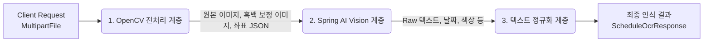
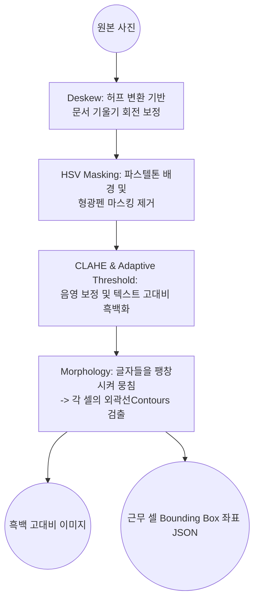
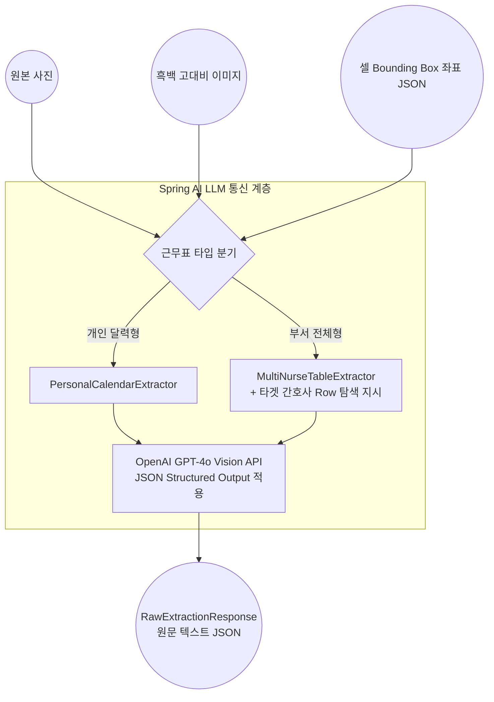
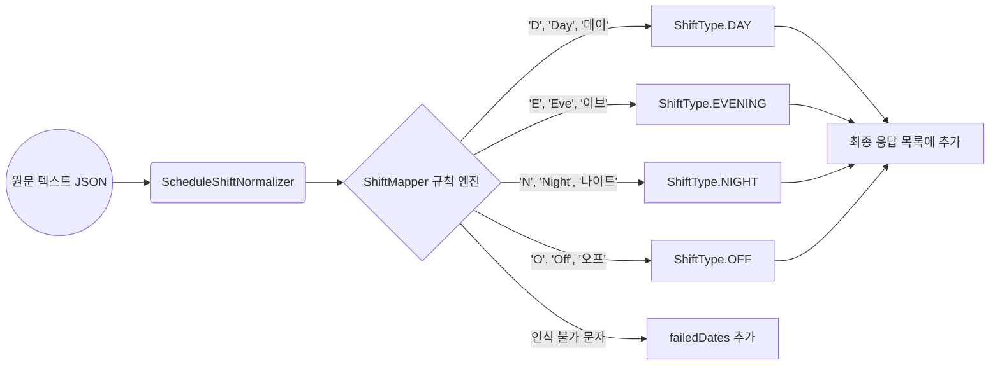

# 근무표 OCR 및 Vision 처리 아키텍처

본 문서는 AiServer의 근무표 인식 파이프라인을 한눈에 파악할 수 있도록 다이어그램 위주로 요약한 문서입니다.

---

## 1. 전체 아키텍처 요약 (High-level Flow)

AiServer는 단순 텍스트 추출이 아닌, **이미지 정제 -> AI 시각 분석 -> 도메인 규칙 정규화**의 3단계 파이프라인으로 구성되어 있습니다.

---

## 2. 계층별 세부 동작

### 2.1. [Step 1] OpenCV 기반 전처리 (OpenCvImagePreprocessor)
Vision 모델(GPT-4o)이 텍스트를 정확하게 읽을 수 있도록 노이즈를 제거하고 형태를 뚜렷하게 만드는 과정입니다.

### 2.2. [Step 2] Dual-Image Vision 검출 (Spring AI)
원본의 **문맥(색상, 레이아웃)**과 전처리본의 **뚜렷한 글자**를 상호 보완적으로 활용하는 **Dual-Image** 전략을 사용합니다.

### 2.3. [Step 3] 텍스트 정규화 (ScheduleShiftNormalizer)
Vision AI가 추출해 낸 날것의 문자열(Raw String)을 시스템 표준 코드로 안전하게 매핑합니다.

---

## 3. 요약: 아키텍처 설계 포인트
1. **노이즈 강건성**: OpenCV를 활용하여 촬영 각도, 빛 반사, 형광펜 마킹으로 인한 오인식 방지
2. **환각(Hallucination) 억제**: Vision 모델에게 단순히 이미지만 던지지 않고, `셀 좌표(JSON)`를 주입하고 `JSON 구조화 출력`을 강제하여 엉뚱한 값을 지어내는 현상 차단
3. **확장성**: 부서 전체 근무표, 개인 달력 등 양식이 달라지더라도 프롬프트 템플릿(`.st`)만 교체하면 되는 모듈형 구조
