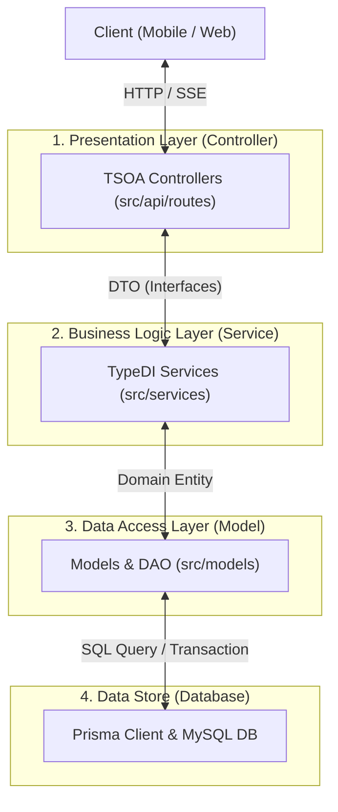

# 🧩 TAMMY v3 Backend Design Patterns & Architecture Specification

본 문서는 **NASA_backEnd (TAMMY v3)**의 실제 백엔드 소스코드(`src/`) 구조를 종합 분석하여 작성된 계층형 아키텍처(Layered Architecture), 적용된 주요 디자인 패턴 및 레이어별 역할 분담 명세서입니다.

---

## 1. 프로젝트 디렉터리 구조 (Directory Structure)

```
src/
├── api/                    # HTTP REST API 게이트웨이 및 라우팅 계층
│   ├── middlewares/        # Express 커스텀 미들웨어 (인증, 보안 등)
│   └── routes/             # TSOA 데코레이터 기반 Controller (요청 수신 & 응답)
│       ├── ChatController.ts
│       ├── ExerciseController.ts
│       ├── FoodController.ts
│       ├── ReportController.ts
│       ├── TravelController.ts
│       └── UserController.ts
├── config/                 # 시스템 환경 변수 및 설정 파일 (dotenv 등)
│   └── index.ts
├── interfaces/             # 계층 간 데이터 전달용 DTO (Data Transfer Object) 정의
│   └── index.ts
├── loaders/                # 애플리케이션 시작 시 모듈/의존성 초기화 (Startup Bootstrapper)
│   ├── express.ts          # Express 라우트, CORS, 미들웨어 및 에러 핸들러 설정
│   ├── ioc.ts              # TypeDI IoC 컨테이너 설정
│   ├── logger.ts           # Winston 로거 싱글톤 설정
│   ├── prisma.ts           # Prisma ORM 데이터베이스 커넥션 관리
│   └── swagger.ts          # OpenAPI / Swagger UI 자동 연동 모듈
├── models/                 # 데이터 액세스 계층 (DAO / Data Access & Queries)
│   ├── EmotionLog.ts
│   ├── ExerciseLog.ts
│   ├── Meal.ts
│   ├── Planet.ts
│   ├── TammyStatus.ts
│   ├── User.ts
│   └── WaterLog.ts
├── services/               # 핵심 비즈니스 로직 및 외부 연동 서비스 (Service Layer)
│   ├── aiService.ts        # AI 모델 연동 및 프롬프트 생성 서비스
│   ├── authService.ts      # 사용자 인증 및 토큰 처리 서비스
│   ├── chatService.ts      # AI 대화 스트리밍 & Action 분석 오케스트레이션
│   ├── exerciseService.ts  # MET 기반 소모 칼로리 정밀 계산 및 운동 저장
│   ├── foodService.ts      # 식단 영양 정보 처리 및 사진 분석 서비스
│   ├── reportService.ts    # 월간 건강 통계 집계 및 리포트 생성
│   ├── travelService.ts    # 우주선 연료 충전, 좌표 이동 및 행성 탐사 로직
│   └── userService.ts      # 프로필 및 타미 상태 관리 서비스
└── app.ts                  # 애플리케이션 서빙 엔트리 포인트 (Server Launcher)
```

---

## 2. 계층형 아키텍처 (Layered Architecture)

TAMMY v3 백엔드는 **관심사 분리(Separation of Concerns)** 원칙에 따라 4개의 뚜렷한 계층으로 구분되어 있으며, 데이터는 상위 계층에서 하위 계층으로 한 방향(Top-Down)으로 흐릅니다.



### 계층별 역할 및 책임 명세

| 계층 (Layer) | 주요 위치 | 핵심 역할 및 책임 |
| :--- | :--- | :--- |
| **Presentation Layer** | `src/api/routes/` | - HTTP 요청 수신, 쿼리/바디 파라미터 바인딩 및 유효성 검증<br>- TSOA 데코레이터를 이용한 OpenAPI/Swagger 문서 자동 생성<br>- SSE 실시간 스트리밍 패스스루 통로 역할 및 HTTP 상태 코드 반환 |
| **Business Logic Layer** | `src/services/` | - 핵심 비즈니스 규칙 수행 (MET 칼로리 소모 계산, 우주선 연료/EXP 지급 등)<br>- 트랜잭션 오케스트레이션 및 외부 AI API 서비스 연동<br>- 서비스 간의 의존성 주입(TypeDI)을 활용한 로직 결합 |
| **Data Access Layer** | `src/models/` | - Prisma ORM 클라이언트를 사용한 100% Direct DB CRUD 쿼리 수행<br>- 데이터베이스 트랜잭션(`$transaction`) 캡슐화 및 엔티티 타입 반환 |
| **Bootstrapper & Config** | `src/loaders/`, `src/config/` | - 애플리케이션 시작 시 DB 연결, 로거, Express 라우터, IoC 컨테이너 초기화 |

---

## 3. 적용된 핵심 디자인 패턴 (Design Patterns)

### 3.1 의존성 주입 패턴 (Dependency Injection Pattern)
- **적용 기술**: `typedi`
- **구현 방식**: `@Service()` 데코레이터와 **생성자 주입(Constructor Injection)**을 사용하여 클래스 간의 강한 결합도를 제거했습니다.
- **코드 예시 (`src/services/chatService.ts`)**:
```typescript
@Service()
export default class ChatService {
  constructor(
    private aiService: AiService,
    private travelService: TravelService
  ) {}
  // ...
}
```

### 3.2 싱글톤 패턴 (Singleton Pattern)
- **적용 대상**: Prisma 데이터베이스 클라이언트 (`src/loaders/prisma.ts`), Winston 로거 (`src/loaders/logger.ts`)
- **구현 방식**: 애플리케이션 전체에서 하나의 DB 커넥션 풀과 로거 인스턴스만 공유하도록 싱글톤 헬퍼 함수를 제공합니다.
- **코드 예시 (`src/loaders/prisma.ts`)**:
```typescript
let prisma: PrismaClient;

export function getPrisma(): PrismaClient {
  if (!prisma) {
    prisma = new PrismaClient();
  }
  return prisma;
}
```

### 3.3 데이터 접근 객체 (DAO / Data Access Object) 패턴
- **적용 대상**: `src/models/*.ts` (`MealModel`, `ExerciseModel`, `WaterLogModel` 등)
- **구현 방식**: 서비스 로직 내에 SQL/Prisma 쿼리가 흩어지지 않도록, 모델 파일 내부의 `static` 메서드로 DB 쿼리를 캡슐화했습니다.
- **코드 예시 (`src/models/Meal.ts`)**:
```typescript
export class MealModel {
  public static async findLogsByUserId(userId: number, limit = 10): Promise<Meal[]> { ... }
  public static async createMeal(...): Promise<number> { ... }
}
```

### 3.4 데이터 전달 객체 (DTO / Data Transfer Object) 패턴
- **적용 대상**: `src/interfaces/index.ts`
- **구현 방식**: Controller와 Service 계층 간에 전달되는 Request/Response 데이터의 타입을 인터페이스로 정의하여 명확한 API 데이터 계약을 보장합니다.

### 3.5 부트스트랩 파이프라인 패턴 (Bootstrapper Pattern)
- **적용 대상**: `src/loaders/index.ts` 및 `src/loaders/express.ts`
- **구현 방식**: 서버 구동에 필요한 모듈들(Express, DB, Logger, Swagger)을 순차적으로 체이닝 로딩하여 안전하게 애플리케이션을 부팅합니다.

---

## 4. 대표적 코드 흐름 사례 (Code Flow Case Study)

### 유저의 대화 메시지 수신 및 자동 건강 기록 처리 흐름 (`/api/ai/chat`)

1. **`ChatController` (Presentation Layer)**:
   - `POST /api/ai/chat?userId=1` 요청 수신.
   - `ChatService`에 비즈니스 처리 위임.
2. **`ChatService` (Business Logic Layer)**:
   - `AiService.generateContent()`를 호출하여 AI 공감 답변 및 의도(Action JSON) 추출.
   - 수신된 Action(LOG_WATER, LOG_WORKOUT 등)을 검증.
   - `TravelService.addFuel()`을 호출하여 미션 완수에 따른 연료 보상 계산.
3. **`WaterLogModel` / `ExerciseModel` / `MealModel` (Data Access Layer)**:
   - `PrismaClient` 싱글톤을 이용하여 해당 사용자 ID로 MySQL DB에 영구 기록 및 트랜잭션 완료.
4. **`ChatController` ➔ Client**:
   - 실시간 답변과 함께 처리 완료된 액션 피드백 결과 반환.
