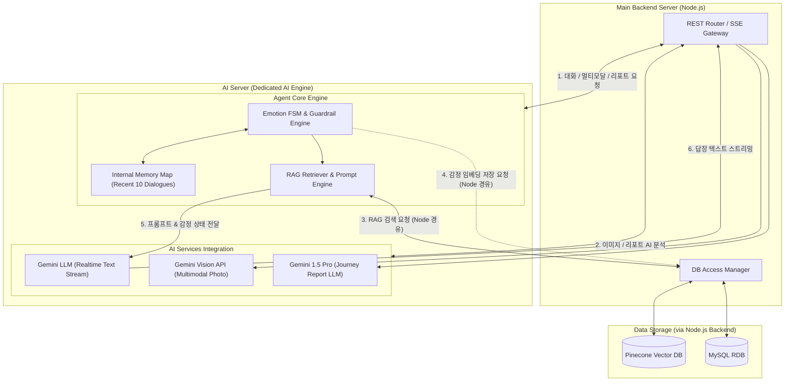

# 🧠 AI Server Architecture (Dedicated AI Engine)

> **AI Server**는 사용자의 감정 상태 추적(Emotion FSM), 실시간 대화 프롬프트 구성(RAG Module), In-Memory 버퍼 관리, 및 **Gemini AI Services(Chat, Vision, Report)** 연동을 전담하는 독립된 AI 전용 엔진입니다.

---

## 1. 개요 및 역할 (Overview & Responsibilities)

AI Server는 메인 백엔드 서버(Node.js)로부터 요청을 전달받아 복잡한 정서 전이 계산 및 AI 추론을 수행합니다. 데이터베이스에 직접 접근하지 않고 **Node.js 백엔드의 DB Access Manager를 경유하여 Pinecone 및 MySQL과 연동**됩니다.

- **정서 FSM 및 가드레일 (Emotion FSM & Guardrail)**: 사용자의 감정 전이를 계산하고 유해 입력 필터링.
- **인메모리 버퍼 (Internal Memory Map)**: 최근 10회의 대화 맥락 및 감정 상태를 0.01ms 내외로 고속 조회.
- **RAG 리트리버 (RAG Module)**: Node.js 백엔드를 통해 Pinecone Vector DB에서 장기 정서 맥락을 검색하여 프롬프트 구성.
- **AI 서비스 통합 (AI Services Integration)**: Gemini LLM(실시간 스트리밍), Gemini Vision(사진 분석), Gemini 1.5 Pro(우주 여행 리포트) 제어.

---

## 2. 아키텍처 다이어그램 (AI Server Architecture Diagram)

---

## 3. 핵심 컴포넌트 상세 (Core Components)

### 3.1 Agent Core Engine
- **Emotion FSM & Guardrail Engine**:
  - 사용자 발화의 감정 키워드 분석 및 정서 상태 전이 계산.
  - 비도덕적/유해성 입력 검증 및 안정화 가드레일 동작.
- **Internal Memory Map (In-Memory Buffer)**:
  - 사용자별 최근 10개 대화 문맥 및 현재 감정 상태 보존.
  - RAG 검색 이전의 초저지연(0.01ms) 단기 기억 파이프라인.
- **RAG Retriever & Prompt Engine**:
  - 단기 기억만으로 부족한 장기 정서 맥락 필요 시, Node.js `DB Access Manager`를 호출하여 Pinecone 쿼리 실행.
  - 검색된 장기 기억과 FSM 감정 상태를 조합하여 Gemini 프롬프트 동적 생성.

### 3.2 AI Services Integration
- **Gemini Chat (Text Streaming)**:
  - 실시간 대화 스트리밍 전담. Node.js REST/SSE 게이트웨이로 텍스트 토큰 분할 전달.
- **Gemini Vision API**:
  - 식사 및 일상 사진의 멀티모달 분석 수행.
- **Gemini 1.5 Pro (Space Journey Report)**:
  - 축적된 사용자의 정서 궤적을 종합 분석하여 우주 여행 리포트 생성.

---

## 4. 데이터 연동 방식 (DB Interconnection Pattern)

1. **DB 직접 접속 불가 (No Direct DB Driver)**:
   - AI Server는 Pinecone 및 MySQL 접속 정보(API Key, DB Credentials)를 직접 소유하지 않음.
2. **Node.js 백엔드 프록시 경유**:
   - RAG 검색 필요 시: `AI Server RAG Module` ➔ `Node.js DB Access Manager API` ➔ `Pinecone Vector DB`
   - 감정 벡터 저장 필요 시: `AI Server FSM Engine` ➔ `Node.js DB Access Manager API` ➔ `Pinecone / MySQL`
