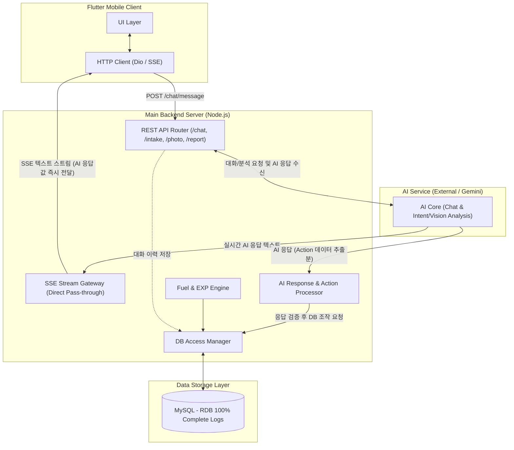

# 🏗️ Main Backend Server Architecture (Node.js API & Gateway)

> **NASA_backEnd** 메인 백엔드 서버는 클라이언트 접속 게이트웨이, 서비스 비즈니스 로직, 보상 계산(Fuel/EXP), 및 **전체 데이터베이스(MySQL RDB)의 접근 및 제어를 일원화**하여 전담하는 핵심 서버입니다. AI 서비스가 생성한 텍스트 응답값은 SSE 텍스트 스트림을 통해 클라이언트에 즉시 전달되며, 백엔드는 AI 응답 결과를 확인하여 데이터 검증 및 DB 조작을 직접 처리합니다.

---

## 1. 개요 및 역할 (Overview & Responsibilities)

Node.js 기반의 메인 백엔드 서버는 시스템의 안정성과 데이터 무결성을 보장하며, 클라이언트와의 저지연 실시간 통신 및 AI 서비스 응답 분석에 따른 DB 조작을 통합 관리합니다.

- **클라이언트 게이트웨이 (Client Gateway)**: HTTP REST API 및 SSE (Server-Sent Events) 실시간 스트리밍 엔드포인트 제공. (AI 응답 텍스트를 즉시 직통 패스스루 스트리밍)
- **데이터베이스 관리 및 제어 일원화 (Centralized DB Control)**: MySQL RDB 커넥션 드라이버를 독점 관리하며 모든 DB CRUD 조작 전담.
- **AI 응답 기반 DB 처리 (AI Response-driven DB Action)**: AI로부터 수신된 분석 결과(의도/액션 추출 데이터 등)를 확인·검증하여 DB 적재 및 비즈니스 로직 수행.
- **보상 엔진 (Reward Engine)**: 사용자의 활동 및 AI 분석 기반 기록에 따른 Fuel / EXP 포인트 산출 및 DB 반영.
- **AI Service 중계 (AI Service Proxy)**: 클라이언트 대화/사진/리포트 요청을 AI 서비스로 전달하고 응답 수신.

---

## 2. 아키텍처 다이어그램 (Backend Architecture Diagram)

---

## 3. 핵심 컴포넌트 상세 (Core Components)

### 3.1 REST Router & SSE Stream Gateway
- **프로토콜**: HTTP REST API + SSE (Server-Sent Events)
- **주요 기능**:
  - `POST /chat/messages`: 클라이언트 발화 수신 및 대화 세션 처리.
  - **SSE 실시간 스트리밍**: AI 서비스가 생성하는 텍스트 응답값을 별도 대기나 중간 가공 없이 SSE 스트림으로 클라이언트에 **즉시 직접 전달**.
  - 대화 완료 후 전체 대화 로그 및 처리된 액션을 `DB Access Manager`를 통해 MySQL에 비동기 저장.

### 3.2 REST API Router (/intake, /photo, /report)
- **엔드포인트**:
  - `POST /intake`: 감정 및 식사 텍스트 입력 처리.
  - `POST /photo`: 식사/일상 사진 업로드 (AI Vision 호출 및 영양 정보 응답 수신).
  - `GET /report`: 우주여행 정서 분석 리포트 요청.
- **주요 기능**: 요청 검증, AI 서비스로 분석 위임, AI 응답 수신 후 백엔드에서 결과 처리 및 반환.

### 3.3 DB Access Manager (중앙 데이터 제어 관리자)
- **MySQL Driver**: 사용자의 대화 기록, 계정 정보, 건강 로그(수분/기분/운동/식단), 리워드 내역 등의 CRUD 조작 100% 전담.
- **AI 응답 기반 DB 제어**: AI 서비스는 DB에 직접 접근하지 않으며, AI가 추출하여 반환한 응답(Action Payload 등)을 백엔드가 확인한 후 백엔드의 `DB Access Manager`에서 직접 DB에 반영.
- **보안 & 데이터 일관성**: 모든 DB 커넥션, 쿼리 실행, 트랜잭션 처리를 백엔드에서만 독점 관리.

### 3.4 Fuel & EXP Engine (보상 엔진)
- AI 응답을 통해 확인된 건강 기록(식단, 운동, 수분 등) 및 사용자 활동에 따른 Fuel(연료) 및 EXP(경험치) 계산.
- DB 갱신 및 응답 데이터에 보상 변동 내역 동시 전달.

---

## 4. 데이터 및 통신 시퀀스 (Communication Sequences)

### 4.1 실시간 채팅 및 AI 응답 처리 흐름
1. `Client` ➔ `RESTRouter`: 사용자의 대화 메시지 송신.
2. `RESTRouter` ➔ `AI Service`: 대화 처리 및 의도(Action) 파악 요청.
3. `AI Service` ➔ `SSEGateway`: Gemini AI 응답 텍스트 즉시 스트리밍.
4. `SSEGateway` ➔ `Client`: AI 응답 텍스트를 SSE 스트림으로 클라이언트에 **즉시 실시간 전달**.
5. `AI Service` ➔ `ActionProcessor`: AI가 파악한 의도(Action) 데이터 반환 및 데이터 검증/확인.
6. `ActionProcessor` ➔ `DB Access Manager`: 확인된 Action(운동, 수분, 감정 기록 등)에 대해 MySQL DB 저장 및 보상 지급 요청.
7. `DB Access Manager` ➔ `MySQL`: 대화 이력 및 건강 기록 영구 저장.

