# 🔀 NASA Wellness v3 – 시퀀스 다이어그램

> **최종 수정일**: 2026-08-11 (소스코드 기준 동기화)
> 본 문서는 FE, BE, DB, AI-server 간의 데이터 흐름을 정의합니다.
> Controller(`src/api/routes`) → Service(`src/services`) → Repository(`src/repositories`) 계층과 100% 일치하도록 작성되었습니다.

---

## 1. 1-Tap 퀵버튼 기록 & 연료(Fuel) 충전 시퀀스

사용자가 1-Tap 퀵버튼으로 데일리 웰니스 항목을 기록하고 우주 연료(Fuel)를 적립하는 과정입니다.

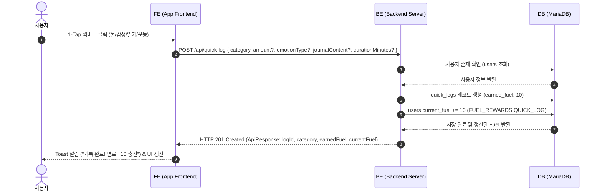

---

## 2. 별여행 탐사 & AI 진단서 동기 생성 시퀀스

연료를 소진하여 별여행 탐사를 출발하고, BE에서 AI-server로 동기 요청을 보내 진단서를 생성하여 즉시 응답하는 과정입니다.

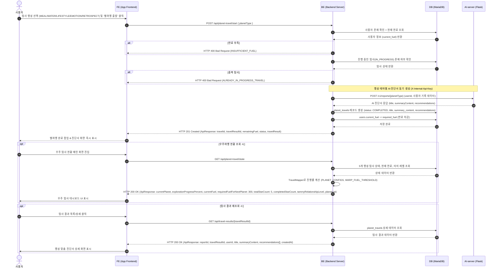

---

## 3. 사진 촬영, AI/YOLO 음식 검출 및 영양 매칭 시퀀스

### 3.1 사진 촬영 & 음식 검출 API 시퀀스

식단 사진 업로드 시 백엔드로 이미지를 전달하고 검출된 음식 명칭 및 바운딩 박스를 반환받는 시퀀스입니다.

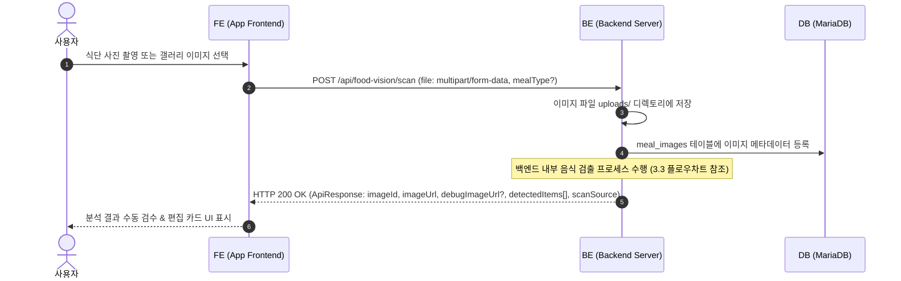

### 3.2 식단 확정 & 영양 기록 API 시퀀스

사용자 검수 후 식단을 확정하면 영양 성분을 매칭하고 식단 기록을 저장 및 연료를 적립하는 시퀀스입니다.

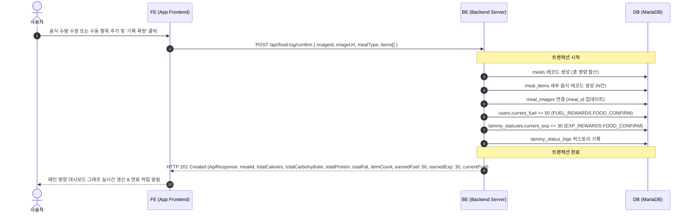

### 3.3 백엔드 음식 검출 & AI-RDB 매칭 프로세스 (알고리즘 플로우차트)

백엔드 내부에서 수행되는 **(1) 로컬 ONNX YOLOv8 1차 스캔 & Vision LLM Fallback 검출** 및 **(2) food_mappings 기반 식약처 RDB 영양 DB 매칭 & AI Lookup Fallback** 프로세스입니다.

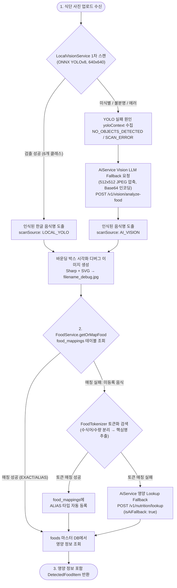

---

## 4. AI 타미 심리 공감 대화 & AI-server 대화 시퀀스

사용자 메시지를 DB에 즉시 저장한 뒤, 최근 대화 히스토리를 추출하여 AI-server(`POST /v1/chat/process`)로 전달하고, 공감 응답 및 감정 상태/캐릭터 반응 모션을 수령하여 저장하는 과정입니다.

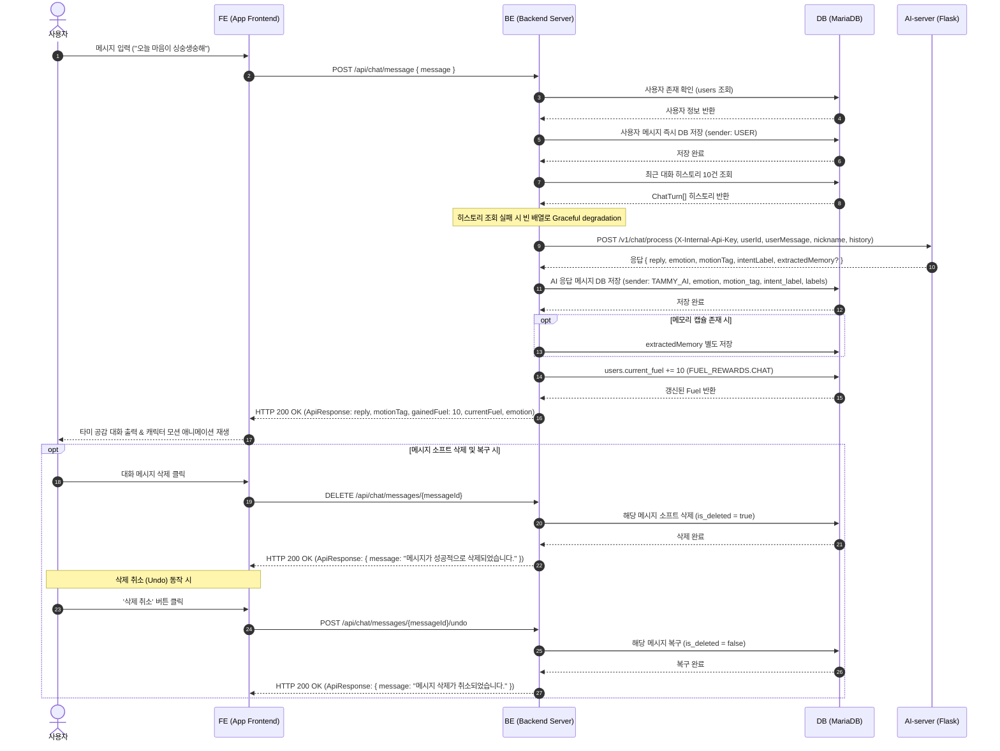

---

## 5. 상시 웰니스 대시보드 통계 조회 시퀀스

메인 화면 진입 시 FE가 상시 웰니스 통계(칼로리 추이, 3대 영양소, 수분/운동/감정 횟수)를 조회하는 과정입니다.

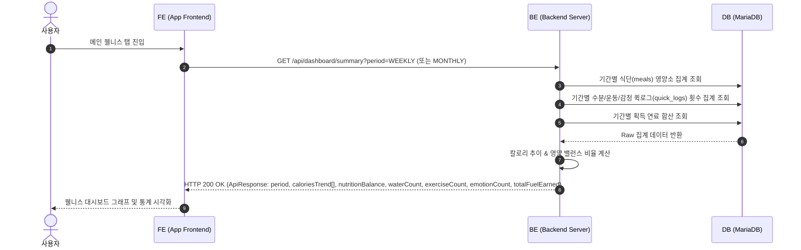

---

## 6. JWT 로그인 & Access Token 자동 갱신 시퀀스

사용자 로그인 시 토큰 발급 및 API 요청 중 Access Token 만료 시 Refresh Token으로 자동 재발급받는 과정입니다.

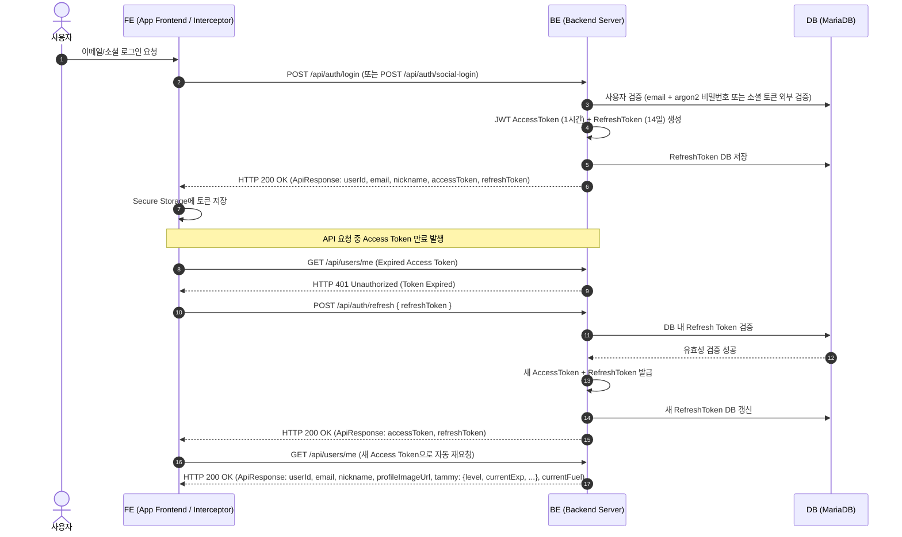

---

## 7. 회원가입 & 타미 초기화 시퀀스

회원가입 시 사용자 레코드와 타미 상태를 원자적으로 생성하는 과정입니다.

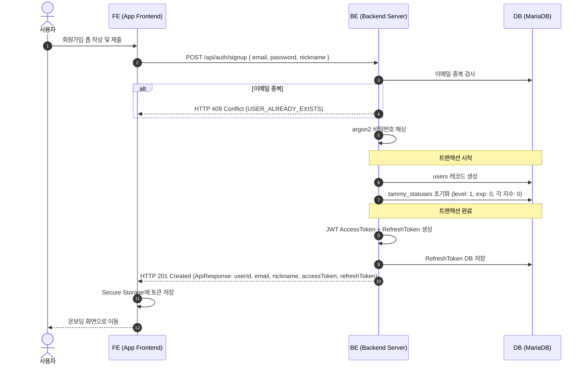

---

## 8. 회원 탈퇴 & 데이터 정리 시퀀스

회원 탈퇴 요청 시 사용자 데이터를 정리하는 과정입니다.

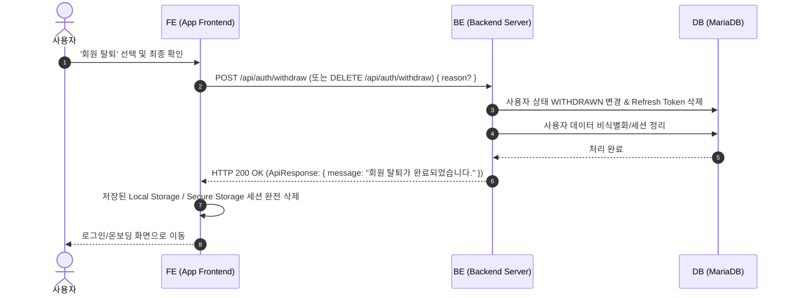

---

## 9. 사용자 프로필 & 타미 상태 조회 시퀀스

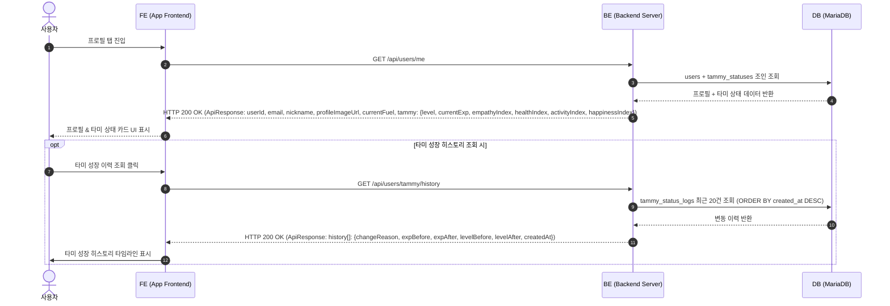

---

## 10. 푸시 토큰 등록 시퀀스

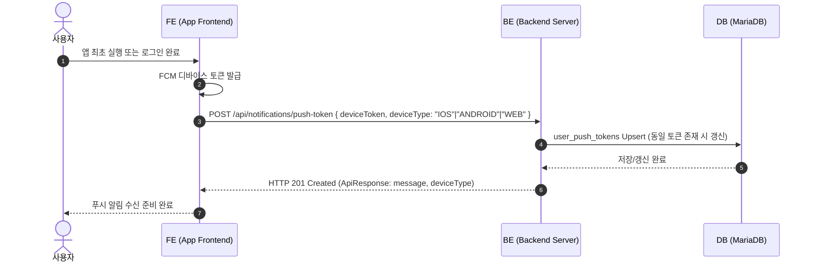

---

## 11. Cron 스케줄러 – 선제적 안부 트리거 생성

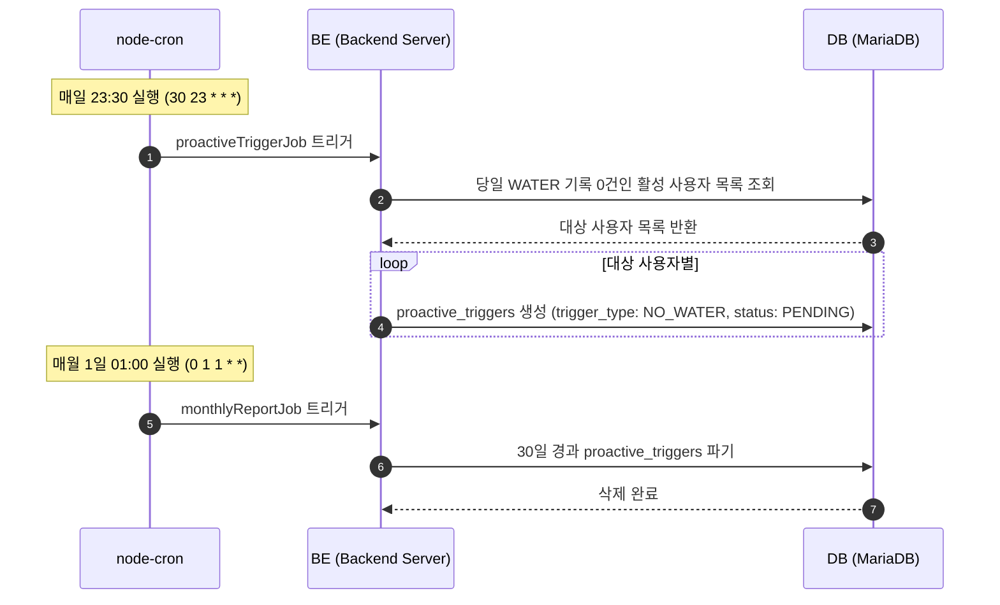
