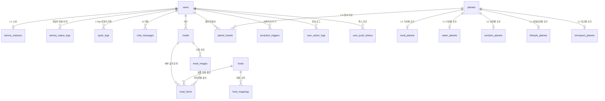

# 🗃️ NASA Wellness v3 – 데이터 모델 및 DB 스키마 명세서

> **최종 수정일**: 2026-08-11 (Prisma 스키마 `prisma/schema.prisma` 기준 동기화)
> **DB**: MariaDB/MySQL (Prisma 7 + Driver Adapter)
> **테이블 수**: 20개 | **Enum 수**: 15개

---

## 1. 개요 및 도메인별 엔티티 관계 (ER Diagram)

---

## 2. ENUM 타입 정의

| ENUM 이름 | 값 (Values) | 설명 |
|:----------|:-----------|:-----|
| `DeviceType` | `IOS`, `ANDROID`, `WEB` | 디바이스 타입 |
| `AuthProvider` | `LOCAL`, `KAKAO`, `GOOGLE`, `APPLE` | 계정 인증 수단 |
| `UserStatus` | `ACTIVE`, `INACTIVE`, `WITHDRAWN` | 회원 계정 상태 |
| `Gender` | `MALE`, `FEMALE`, `OTHER` | 성별 |
| `LogCategory` | `WATER`, `EMOTION`, `JOURNAL`, `EXERCISE` | 1-Tap 퀵버튼 카테고리 |
| `PlanetType` | `MEAL`, `WATER`, `EMOTION`, `LIFESTYLE`, `RETROSPECT` | 5대 행성 카테고리 |
| `TravelStatus` | `IN_PROGRESS`, `COMPLETED`, `FAILED` | 탐사 진행 상태 |
| `Sender` | `USER`, `TAMMY`, `TAMMY_AI` | 대화 메시지 발신자 |
| `MealType` | `BREAKFAST`, `LUNCH`, `DINNER`, `SNACK` | 식사 종류 |
| `EmotionState` | `HAPPY`, `SAD`, `ANGRY`, `STRESSED`, `CALM` | 기분/정서 상태 |
| `TriggerType` | `NEG_EMOTION`, `NO_WATER`, `NO_EXERCISE`, `SYSTEM` | 선제적 트리거 유형 |
| `ProactiveStatus` | `PENDING`, `SENT`, `RESPONDED`, `EXPIRED` | 트리거 처리 상태 |
| `ActionType` | `CLICK`, `SCREEN_VIEW`, `SCROLL`, `TEXT_INPUT`, `BUTTON_TAP` | 사용자 행동 유형 |
| `ChangeReason` | `MEAL_LOG`, `WORKOUT_CHECK`, `WATER_LOG`, `MOOD_LOG`, `CHAT_EMPATHY`, `LEVEL_UP`, `WARP` | 타미 경험치 변동 사유 |
| `MatchType` | `EXACT`, `ALIAS`, `USER_CONFIRMED` | 음식 매칭 유형 |

---

## 3. 세부 테이블 스키마 명세

### 3.1 사용자 & 타미 상태 도메인

#### 1) `users` (사용자 마스터)

| 컬럼명 | 데이터 타입 | 제약 조건 | 설명 |
|:-------|:-----------|:---------|:-----|
| `id` | INT | PK, AUTO_INCREMENT | 사용자 고유 ID |
| `email` | VARCHAR(255) | UNIQUE, NOT NULL | 이메일 계정 |
| `password_hash` | VARCHAR(255) | NULLABLE | 비밀번호 해시 (argon2) |
| `auth_provider` | ENUM(`AuthProvider`) | DEFAULT 'LOCAL' | 인증 수단 |
| `nickname` | VARCHAR(50) | NOT NULL | 닉네임 |
| `gender` | ENUM(`Gender`) | NULLABLE | 성별 |
| `age` | INT | NULLABLE | 나이 |
| `current_fuel` | INT | NULLABLE, DEFAULT 0 | 보유 연료량 (Fuel) |
| `refresh_token` | TEXT | NULLABLE | JWT Refresh Token |
| `status` | ENUM(`UserStatus`) | DEFAULT 'ACTIVE' | 계정 상태 |
| `last_login_at` | TIMESTAMP | NULLABLE | 최근 로그인 일시 |
| `created_at` | TIMESTAMP | DEFAULT CURRENT_TIMESTAMP | 계정 생성 일시 |
| `updated_at` | TIMESTAMP | DEFAULT CURRENT_TIMESTAMP, AUTO UPDATE | 계정 수정 일시 |

**인덱스**: `idx_user_email` (email)

**관계**:
- 1:1 → `tammy_statuses`
- 1:N → `quick_logs`, `planet_travels`, `meals`, `chat_messages`, `proactive_triggers`, `user_action_logs`, `tammy_status_logs`, `user_push_tokens`

---

#### 2) `tammy_statuses` (타미 캐릭터 상태 – 1:1)

| 컬럼명 | 데이터 타입 | 제약 조건 | 설명 |
|:-------|:-----------|:---------|:-----|
| `user_id` | INT | PK, FK (users.id, CASCADE) | 사용자 ID |
| `level` | INT | DEFAULT 1 | 관계 레벨 |
| `current_exp` | INT | DEFAULT 0 | 누적 경험치 |
| `empathy_index` | INT | DEFAULT 0 | 공감 지수 |
| `health_index` | INT | DEFAULT 0 | 건강 지수 |
| `activity_index` | INT | DEFAULT 0 | 활동 지수 |
| `happiness_index` | INT | DEFAULT 0 | 행복 지수 |
| `updated_at` | TIMESTAMP | DEFAULT CURRENT_TIMESTAMP, AUTO UPDATE | 갱신 일시 |

---

#### 3) `tammy_status_logs` (타미 경험치 변동 로그)

| 컬럼명 | 데이터 타입 | 제약 조건 | 설명 |
|:-------|:-----------|:---------|:-----|
| `id` | BIGINT | PK, AUTO_INCREMENT | 로그 ID |
| `user_id` | INT | FK (users.id, CASCADE) | 사용자 ID |
| `change_reason` | ENUM(`ChangeReason`) | NOT NULL | 변동 사유 |
| `delta_exp` | INT | DEFAULT 0 | 경험치 변동량 |
| `delta_empathy` | INT | DEFAULT 0 | 공감 지수 변동량 |
| `delta_health` | INT | DEFAULT 0 | 건강 지수 변동량 |
| `delta_activity` | INT | DEFAULT 0 | 활동 지수 변동량 |
| `delta_happiness` | INT | DEFAULT 0 | 행복 지수 변동량 |
| `snapshot_level` | INT | NOT NULL | 변경 시점 레벨 스냅샷 |
| `snapshot_total_exp` | INT | NOT NULL | 변경 시점 총 경험치 스냅샷 |
| `created_at` | TIMESTAMP | DEFAULT CURRENT_TIMESTAMP | 기록 일시 |

**인덱스**: `idx_tammy_log_user_created` (user_id, created_at DESC)

---

### 3.2 행성 마스터 & 5대 행성 1:1 특화 도메인

#### 1) `planets` (행성 마스터)

| 컬럼명 | 데이터 타입 | 제약 조건 | 설명 |
|:-------|:-----------|:---------|:-----|
| `id` | INT | PK, AUTO_INCREMENT | 행성 ID |
| `name` | VARCHAR(100) | NOT NULL | 행성 이름 |
| `planet_type` | ENUM(`PlanetType`) | NOT NULL | 5대 행성 카테고리 |
| `required_fuel` | INT | DEFAULT 100 | 도착 필요 연료량 |
| `description` | TEXT | NULLABLE | 행성 설명 |
| `created_at` | TIMESTAMP | DEFAULT CURRENT_TIMESTAMP | 생성 일시 |

**관계**: 1:1 → 5개 특화 테이블, 1:N → `planet_travels`

---

#### 2) `meal_planets` (식사별 특화 조건 – 1:1)

| 컬럼명 | 데이터 타입 | 제약 조건 | 설명 |
|:-------|:-----------|:---------|:-----|
| `planet_id` | INT | PK, FK (planets.id, CASCADE) | 행성 ID |
| `target_calories_kcal` | INT | DEFAULT 0 | 목표 칼로리 |
| `target_carbohydrate_g` | DECIMAL(5,2) | DEFAULT 0.00 | 목표 탄수화물 (g) |
| `target_protein_g` | DECIMAL(5,2) | DEFAULT 0.00 | 목표 단백질 (g) |
| `target_fat_g` | DECIMAL(5,2) | DEFAULT 0.00 | 목표 지방 (g) |

---

#### 3) `water_planets` (수분별 특화 조건 – 1:1)

| 컬럼명 | 데이터 타입 | 제약 조건 | 설명 |
|:-------|:-----------|:---------|:-----|
| `planet_id` | INT | PK, FK (planets.id, CASCADE) | 행성 ID |
| `target_water_ml` | INT | DEFAULT 2000 | 목표 수분 섭취량 |
| `min_intake_count` | INT | DEFAULT 4 | 최소 섭취 횟수 |

---

#### 4) `emotion_planets` (감정별 특화 조건 – 1:1)

| 컬럼명 | 데이터 타입 | 제약 조건 | 설명 |
|:-------|:-----------|:---------|:-----|
| `planet_id` | INT | PK, FK (planets.id, CASCADE) | 행성 ID |
| `min_empathy_score` | INT | DEFAULT 0 | 최소 공감 점수 |
| `min_happiness_score` | INT | DEFAULT 0 | 최소 행복 점수 |

---

#### 5) `lifestyle_planets` (생활습관별 특화 조건 – 1:1)

| 컬럼명 | 데이터 타입 | 제약 조건 | 설명 |
|:-------|:-----------|:---------|:-----|
| `planet_id` | INT | PK, FK (planets.id, CASCADE) | 행성 ID |
| `target_workout_duration` | INT | DEFAULT 30 | 목표 운동 시간 (분) |
| `daily_routine_target` | INT | DEFAULT 1 | 데일리 루틴 달성 목표 |

---

#### 6) `retrospect_planets` (회고별 자동 실행 조건 – 1:1)

| 컬럼명 | 데이터 타입 | 제약 조건 | 설명 |
|:-------|:-----------|:---------|:-----|
| `planet_id` | INT | PK, FK (planets.id, CASCADE) | 행성 ID |
| `period_days` | INT | DEFAULT 7 | 회고 주기 (일) |
| `auto_trigger_cron` | VARCHAR(50) | DEFAULT '0 0 * * 0' | 자동 실행 타이머 |

---

#### 7) `planet_travels` (별여행 탐사 이력)

| 컬럼명 | 데이터 타입 | 제약 조건 | 설명 |
|:-------|:-----------|:---------|:-----|
| `id` | BIGINT | PK, AUTO_INCREMENT | 탐사 기록 ID |
| `user_id` | INT | FK (users.id, CASCADE), NOT NULL | 사용자 ID |
| `planet_id` | INT | FK (planets.id, SET NULL), NULLABLE | 탐사 대상 행성 FK |
| `planet_type` | ENUM(`PlanetType`) | NOT NULL | 탐사 행성 카테고리 |
| `fuel_spent` | INT | NOT NULL | 소진된 연료량 |
| `status` | ENUM(`TravelStatus`) | DEFAULT 'IN_PROGRESS' | 탐사 진행 상태 |
| `title` | VARCHAR(255) | NULLABLE | 진단서 제목 |
| `summary_content` | TEXT | NULLABLE | AI 진단 요약문 |
| `recommendations` | TEXT | NULLABLE | 맞춤 추천 가이드 |
| `started_at` | TIMESTAMP | DEFAULT CURRENT_TIMESTAMP | 출발 일시 |
| `completed_at` | TIMESTAMP | NULLABLE | 완료 일시 |

**인덱스**: `idx_travel_user_started` (user_id, started_at DESC)

> ⚠️ 기존 `reports` 별도 테이블 없이, 진단서 데이터가 `planet_travels`에 직접 저장됩니다 (title, summary_content, recommendations).

---

### 3.3 1-Tap 퀵기록 도메인

#### `quick_logs` (1-Tap 데일리 기록)

| 컬럼명 | 데이터 타입 | 제약 조건 | 설명 |
|:-------|:-----------|:---------|:-----|
| `id` | BIGINT | PK, AUTO_INCREMENT | 기록 ID |
| `user_id` | INT | FK (users.id, CASCADE), NOT NULL | 사용자 ID |
| `category` | ENUM(`LogCategory`) | NOT NULL | 기록 카테고리 |
| `amount` | INT | NULLABLE | 섭취 수분량 (ml) |
| `emotion_type` | VARCHAR(50) | NULLABLE | 감정 타입 |
| `journal_content` | TEXT | NULLABLE | 감정일기 본문 |
| `duration_minutes` | INT | NULLABLE | 운동 시간 (분) |
| `burned_calories_kcal` | INT | NULLABLE, DEFAULT 0 | 소모 칼로리 (kcal) |
| `earned_fuel` | INT | DEFAULT 10 | 획득 연료 |
| `created_at` | TIMESTAMP | DEFAULT CURRENT_TIMESTAMP | 기록 일시 |

**인덱스**: `idx_quick_log_user_created` (user_id, created_at DESC)

---

### 3.4 식단 & 영양 마스터 도메인

#### 1) `foods` (표준 음식 영양 마스터 – 식약처 15,568건)

| 컬럼명 | 데이터 타입 | 제약 조건 | 설명 |
|:-------|:-----------|:---------|:-----|
| `id` | INT | PK, AUTO_INCREMENT | 음식 ID |
| `name` | VARCHAR(100) | UNIQUE, NOT NULL | 표준 음식 명칭 |
| `representative_name` | VARCHAR(100) | NULLABLE | 식약처 대표식품명 |
| `standard_serving_g` | DECIMAL(6,2) | DEFAULT 100.00 | 영양성분 함량 기준 중량 (g) |
| `total_weight_g` | DECIMAL(6,2) | NULLABLE | 식품 총 중량 (g) |
| `calories_kcal` | INT | DEFAULT 0 | 열량 (kcal) |
| `carbohydrate_g` | DECIMAL(5,2) | DEFAULT 0.00 | 탄수화물 (g) |
| `protein_g` | DECIMAL(5,2) | DEFAULT 0.00 | 단백질 (g) |
| `fat_g` | DECIMAL(5,2) | DEFAULT 0.00 | 지방 (g) |
| `vitamin_percent` | INT | DEFAULT 0 | 일일 권장 비타민 비율 (%) |
| `mineral_percent` | INT | DEFAULT 0 | 일일 권장 미네랄 비율 (%) |
| `category` | VARCHAR(50) | NULLABLE | 음식 카테고리 (식품대분류명) |
| `created_at` | TIMESTAMP | DEFAULT CURRENT_TIMESTAMP | 등록 일시 |

**관계**: 1:N → `food_mappings`, `meal_items`

---

#### 2) `food_mappings` (음식명 스마트 매칭 맵)

| 컬럼명 | 데이터 타입 | 제약 조건 | 설명 |
|:-------|:-----------|:---------|:-----|
| `id` | BIGINT | PK, AUTO_INCREMENT | 매핑 ID |
| `raw_name` | VARCHAR(100) | UNIQUE, NOT NULL | 원본 음식명 (AI/사용자 입력) |
| `food_id` | INT | FK (foods.id, CASCADE), NOT NULL | 표준 음식 FK |
| `match_type` | ENUM(`MatchType`) | DEFAULT 'EXACT' | 매칭 유형 |
| `created_at` | TIMESTAMP | DEFAULT CURRENT_TIMESTAMP | 등록 일시 |

**인덱스**: `idx_food_mapping_raw` (raw_name)

> EXACT: 정확 매칭, ALIAS: 토큰화 2차 매칭 자동 등록, USER_CONFIRMED: 사용자 확인 매칭

---

#### 3) `meals` (식단 기록 마스터)

| 컬럼명 | 데이터 타입 | 제약 조건 | 설명 |
|:-------|:-----------|:---------|:-----|
| `id` | BIGINT | PK, AUTO_INCREMENT | 식단 기록 ID |
| `user_id` | INT | FK (users.id, CASCADE), NOT NULL | 사용자 ID |
| `meal_type` | ENUM(`MealType`) | NOT NULL | 식사 종류 |
| `comment` | VARCHAR(255) | NULLABLE | 식단 메모 |
| `total_calories_kcal` | INT | DEFAULT 0 | 총 칼로리 |
| `total_carbohydrate_g` | DECIMAL(5,2) | DEFAULT 0.00 | 총 탄수화물 (g) |
| `total_protein_g` | DECIMAL(5,2) | DEFAULT 0.00 | 총 단백질 (g) |
| `total_fat_g` | DECIMAL(5,2) | DEFAULT 0.00 | 총 지방 (g) |
| `vitamin_percent` | INT | DEFAULT 0 | 비타민 비율 |
| `mineral_percent` | INT | DEFAULT 0 | 미네랄 비율 |
| `registered_at` | TIMESTAMP | DEFAULT CURRENT_TIMESTAMP | 등록 일시 |

**인덱스**: `idx_user_meal_registered` (user_id, registered_at DESC)
**관계**: 1:N → `meal_items`, `meal_images`

---

#### 4) `meal_images` (식단 사진)

| 컬럼명 | 데이터 타입 | 제약 조건 | 설명 |
|:-------|:-----------|:---------|:-----|
| `id` | BIGINT | PK, AUTO_INCREMENT | 사진 ID |
| `meal_id` | BIGINT | FK (meals.id, CASCADE), NULLABLE | 식단 ID |
| `image_url` | VARCHAR(255) | NOT NULL | 사진 URL |
| `is_cover` | BOOLEAN | DEFAULT FALSE | 대표 사진 여부 |
| `created_at` | TIMESTAMP | DEFAULT CURRENT_TIMESTAMP | 등록 일시 |

**인덱스**: `idx_meal_image_meal` (meal_id)
**관계**: 1:N → `meal_items`

---

#### 5) `meal_items` (세부 섭취 음식 항목)

| 컬럼명 | 데이터 타입 | 제약 조건 | 설명 |
|:-------|:-----------|:---------|:-----|
| `id` | BIGINT | PK, AUTO_INCREMENT | 세부 항목 ID |
| `meal_id` | BIGINT | FK (meals.id, CASCADE), NOT NULL | 식단 ID |
| `meal_image_id` | BIGINT | FK (meal_images.id, SET NULL), NULLABLE | 사진 ID |
| `food_id` | INT | FK (foods.id, SET NULL), NULLABLE | 표준 음식 FK |
| `custom_food_name` | VARCHAR(100) | NOT NULL | 음식명 |
| `intake_gram` | DECIMAL(6,2) | DEFAULT 100.00 | 섭취 중량 (g) |
| `bounding_box` | JSON | NULLABLE | AI 바운딩 박스 좌표 |
| `confidence` | DECIMAL(5,4) | NULLABLE | AI 인식 신뢰도 |

**인덱스**: `idx_meal_item_image` (meal_image_id)

---

### 3.5 대화 도메인

#### `chat_messages` (AI 타미 심리 공감 대화)

| 컬럼명 | 데이터 타입 | 제약 조건 | 설명 |
|:-------|:-----------|:---------|:-----|
| `id` | BIGINT | PK, AUTO_INCREMENT | 메시지 ID |
| `user_id` | INT | FK (users.id, CASCADE), NOT NULL | 사용자 ID |
| `sender` | ENUM(`Sender`) | NOT NULL | 발신자 (USER / TAMMY / TAMMY_AI) |
| `message_text` | TEXT | NOT NULL | 대화 메시지 본문 |
| `motion_tag` | VARCHAR(50) | NULLABLE | 반응 모션 태그 |
| `intent_label` | VARCHAR(50) | NULLABLE | 인텐트 라벨 |
| `labels` | JSON | NULLABLE | AI 추가 레이블 데이터 |
| `is_deleted` | BOOLEAN | DEFAULT FALSE | 소프트 삭제 여부 |
| `is_edited` | BOOLEAN | DEFAULT FALSE | 수정 여부 |
| `created_at` | TIMESTAMP | DEFAULT CURRENT_TIMESTAMP | 전송 일시 |

**인덱스**:
- `idx_user_msg_created` (user_id, created_at DESC)
- `idx_msg_intent_label` (intent_label)

---

### 3.6 운영 & 분석 도메인

#### 1) `proactive_triggers` (선제적 안부 트리거)

| 컬럼명 | 데이터 타입 | 제약 조건 | 설명 |
|:-------|:-----------|:---------|:-----|
| `id` | BIGINT | PK, AUTO_INCREMENT | 트리거 ID |
| `user_id` | INT | FK (users.id, CASCADE), NOT NULL | 사용자 ID |
| `trigger_type` | ENUM(`TriggerType`) | NOT NULL | 트리거 유형 |
| `reference_id` | BIGINT | NULLABLE | 참조 ID |
| `message_text` | TEXT | NOT NULL | 트리거 메시지 |
| `status` | ENUM(`ProactiveStatus`) | DEFAULT 'PENDING' | 처리 상태 |
| `created_at` | TIMESTAMP | DEFAULT CURRENT_TIMESTAMP | 생성 일시 |

**인덱스**: `idx_user_trigger_created` (user_id, created_at DESC)

> Cron Job(proactiveTriggerJob)이 매일 23:30 수분 미기록 사용자 대상 NO_WATER 트리거를 생성하고, monthlyReportJob이 30일 경과 레코드를 파기합니다.

---

#### 2) `user_action_logs` (사용자 행동 로그)

| 컬럼명 | 데이터 타입 | 제약 조건 | 설명 |
|:-------|:-----------|:---------|:-----|
| `id` | BIGINT | PK, AUTO_INCREMENT | 로그 ID |
| `user_id` | INT | FK (users.id, CASCADE), NOT NULL | 사용자 ID |
| `screen_name` | VARCHAR(100) | NOT NULL | 화면 이름 |
| `action_type` | ENUM(`ActionType`) | NOT NULL | 행동 유형 |
| `target_element_id` | VARCHAR(100) | NULLABLE | 대상 요소 ID |
| `metadata` | JSON | NULLABLE | 추가 메타데이터 |
| `created_at` | TIMESTAMP | DEFAULT CURRENT_TIMESTAMP | 기록 일시 |

**인덱스**: `idx_action_user_created` (user_id, created_at DESC)

---

#### 3) `user_push_tokens` (FCM 푸시 토큰)

| 컬럼명 | 데이터 타입 | 제약 조건 | 설명 |
|:-------|:-----------|:---------|:-----|
| `id` | BIGINT | PK, AUTO_INCREMENT | 토큰 ID |
| `user_id` | INT | FK (users.id, CASCADE), NOT NULL | 사용자 ID |
| `device_token` | VARCHAR(255) | NOT NULL | FCM 디바이스 토큰 |
| `device_type` | ENUM(`DeviceType`) | DEFAULT 'IOS' | 디바이스 타입 |
| `is_active` | BOOLEAN | DEFAULT TRUE | 활성 여부 |
| `updated_at` | TIMESTAMP | DEFAULT CURRENT_TIMESTAMP, AUTO UPDATE | 갱신 일시 |
| `created_at` | TIMESTAMP | DEFAULT CURRENT_TIMESTAMP | 등록 일시 |

**유니크 제약**: `uq_user_device_token` (user_id, device_token)
**인덱스**: `idx_push_token_user` (user_id)

---

## 4. 인덱스 전체 목록

| 테이블 | 인덱스명 | 컬럼 | 유형 |
|:-------|:--------|:-----|:-----|
| users | `idx_user_email` | email | INDEX |
| quick_logs | `idx_quick_log_user_created` | user_id, created_at DESC | INDEX |
| planet_travels | `idx_travel_user_started` | user_id, started_at DESC | INDEX |
| food_mappings | `idx_food_mapping_raw` | raw_name | INDEX |
| meals | `idx_user_meal_registered` | user_id, registered_at DESC | INDEX |
| meal_images | `idx_meal_image_meal` | meal_id | INDEX |
| meal_items | `idx_meal_item_image` | meal_image_id | INDEX |
| chat_messages | `idx_user_msg_created` | user_id, created_at DESC | INDEX |
| chat_messages | `idx_msg_intent_label` | intent_label | INDEX |
| proactive_triggers | `idx_user_trigger_created` | user_id, created_at DESC | INDEX |
| user_action_logs | `idx_action_user_created` | user_id, created_at DESC | INDEX |
| tammy_status_logs | `idx_tammy_log_user_created` | user_id, created_at DESC | INDEX |
| user_push_tokens | `idx_push_token_user` | user_id | INDEX |
| user_push_tokens | `uq_user_device_token` | user_id, device_token | UNIQUE |

---

## 5. Cascade 삭제 정책

| 부모 테이블 | 자식 테이블 | onDelete |
|:-----------|:-----------|:---------|
| users | tammy_statuses, quick_logs, planet_travels, meals, chat_messages, proactive_triggers, user_action_logs, tammy_status_logs, user_push_tokens | **CASCADE** |
| planets | meal_planets, water_planets, emotion_planets, lifestyle_planets, retrospect_planets | **CASCADE** |
| planets | planet_travels | **SET NULL** |
| meals | meal_items, meal_images | **CASCADE** |
| foods | food_mappings | **CASCADE** |
| foods | meal_items | **SET NULL** |
| meal_images | meal_items | **SET NULL** |
