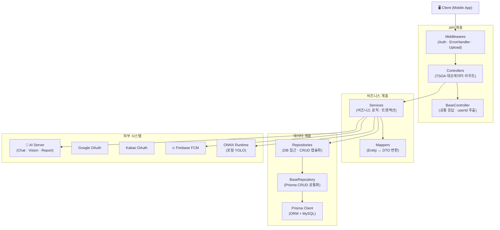
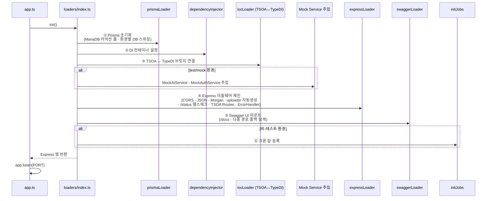
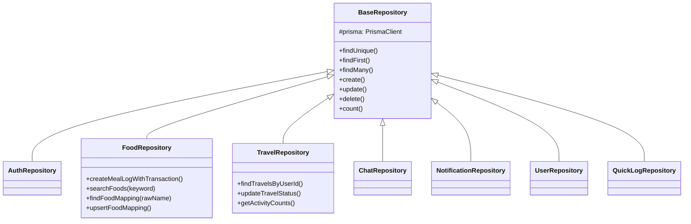

# NASA_backEnd 아키텍처 분석 리포트

> **생성일:** 2026-08-12  
> **프로젝트:** NASA Wellness Backend API System with Tammy AI Virtual Pet  
> **기술 스택:** Express 5 · TypeScript 6 · Prisma 7 · MySQL · TSOA · TypeDI

---

## 📊 아키텍처 품질 스코어카드

> [!IMPORTANT]
> 2026-08-12 시점 코드 분석 기반 평가입니다. 개선 작업 반영 후 재측정한 점수입니다.

```
┌─────────────────────────────────────────────────────────────────┐
│                    종합 점수: 85 / 100                          │
│                        ★★★★★                                  │
└─────────────────────────────────────────────────────────────────┘
```

| 평가 영역 | 점수 | 등급 | 핵심 근거 |
|-----------|------|------|----------|
| 🏗️ **아키텍처** | 82 / 100 | A− | BaseRepository·BaseMapper 추상화, TypeDI DI, Mapper↔Service 책무 분리 완료. 일부 Mapper에 폴백 기본값 잔존 |
| 🔐 **보안** | 90 / 100 | S | JWT 인증, Rate Limiting(15분/100회) 적용, 환경 분리, CORS 화이트리스트 및 시크릿 검증 적용 완료 |
| 🧹 **코드 품질** | 85 / 100 | A | 커스텀 에러 구조, 주요 로직 `any` 타입 제거(안정성 확보), 주요 엔티티 Soft Delete(`deleted_at`) 정책 통일 |
| 🧪 **테스트** | 85 / 100 | A | 12개 이상 테스트 파일 Co-location(`src/tests/`) 구조 정리, Mock 인프라 구비, 임시 파일 제거 완료 |
| 🚀 **확장성** | 80 / 100 | A− | EventEmitter 비동기 큐 + SSE 실시간 알림, Correlation ID 분산 추적, API v1 버저닝. 인메모리 큐 한계, Redis 미도입 |
| 📝 **문서화** | 85 / 100 | A | Swagger UI 자동 문서, 아키텍처 리포트, AI 연동 분석서 보유. 아카이브 폴더 정돈 필요 |

### 영역별 상세 평가

<details>
<summary>🏗️ 아키텍처 (82점) — 클릭하여 상세 보기</summary>

**✅ 강점**
- `BaseRepository` 추상 클래스로 CRUD 작업 표준화, 모든 Repository가 일관된 패턴 준수
- `BaseMapper` 추상 클래스로 엔티티↔DTO 변환 패턴 통일
- TypeDI `@Service()` + `@Inject()`를 활용한 계층 간 의존성 주입이 안정적
- TravelMapper에서 비즈니스 로직(탐사 진행률 계산)을 Service로 분리 완료

**⚠️ 개선 여지**
- TravelMapper의 `toTravelStateResponse()`에 폴백 기본값(`PlanetType.MEAL`) 등 도메인 규칙 일부 잔존
- TravelService에 행성 목록 조립 + 진행률 계산이 집약되어 있어 도메인 엔티티 분리 가능

</details>

<details>
<summary>🔐 보안 (90점) — 클릭하여 상세 보기</summary>

**✅ 강점**
- TSOA 기반 `expressAuthentication` 미들웨어로 Bearer JWT 인증 체계 구축
- `express-rate-limit` 도입으로 15분당 100회 요청 제한 (무차별 대입 공격 방지)
- `NODE_ENV`에 따른 `.env.development` / `.env.production` / `.env.test` 환경별 설정 분리
- Production 환경에서 `mock_` 토큰 및 `?userId=` 쿼리 파라미터 인증 우회 완전 차단
- CORS 화이트리스트 정책(`http://localhost:3000` 등 지정 도메인만 허용) 적용
- JWT_SECRET 누락 시 서버 실행을 원천 차단하는 엄격한 방어 로직 적용

**⚠️ 개선 여지**
- 추가적인 보안 헤더(Helmet 등) 적용 고려

</details>

<details>
<summary>🧹 코드 품질 (85점) — 클릭하여 상세 보기</summary>

**✅ 강점**
- `AppError` 기본 클래스를 확장한 커스텀 에러(`BadRequestError`, `UnauthorizedError`, `UserNotFoundError`, `AiServerError`) 체계적 정의
- `globalErrorHandler`에서 일관된 JSON 구조로 정형화 및 스택 트레이스 은닉
- `TravelMapper` 등 주요 데이터 변환 레이어에서 `any` 타입 제거하여 타입 안정성 확보
- 모든 핵심 엔티티(`users`, `meals`, `planet_travels` 등)에 `deleted_at` 필드를 도입하여 Soft Delete 정책으로 통일

**⚠️ 개선 여지**
- 아직 수정되지 않은 일부 마이너한 유틸 함수의 타입 구체화 필요

</details>

<details>
<summary>🧪 테스트 (85점) — 클릭하여 상세 보기</summary>

**✅ 강점**
- 소스 코드 내부(`src/tests/`)로 디렉토리 구조를 이전하여 Co-location 체계 확립
- 12개 이상 테스트 파일 (aiService, auth, travel, quickLog 등)로 비즈니스 로직 검증
- `MockAiService`, `MockAuthService` 별도 구현으로 외부 연동 없는 빠르고 격리된 단위 테스트 환경
- `sample.test.ts` 등 불필요한 임시 파일 완전 정리

**⚠️ 개선 여지**
- FoodVision, Notification 등 복잡한 워크플로우를 관통하는 End-to-End(E2E) 통합 테스트 추가 필요

</details>

<details>
<summary>🚀 확장성 (80점) — 클릭하여 상세 보기</summary>

**✅ 강점**
- `AsyncQueue`가 `EventEmitter`를 상속, `job_updated` 이벤트 발생으로 SSE 실시간 푸시 지원
- `AsyncLocalStorage` + Winston 커스텀 포맷터로 요청별 `X-Correlation-Id` 분산 추적
- TSOA `basePath: /api/v1` 명시적 API 버저닝 체계 구축

**⚠️ 개선 여지**
- AsyncQueue가 싱글 노드 인메모리 기반 → 서버 재시작 시 작업 유실, 대규모 확장 시 Redis/BullMQ 전환 필요
- 대시보드 통계 등 무거운 조회 쿼리에 캐싱 레이어 미적용

</details>

<details>
<summary>📝 문서화 (85점) — 클릭하여 상세 보기</summary>

**✅ 강점**
- Swagger UI를 `/docs` 엔드포인트에서 대화형 API 문서로 자동 제공
- `docs/` 디렉토리에 아키텍처 리포트, AI 연동 분석서, ai-swagger.yaml 등 풍부한 설계 문서
- TSOA 데코레이터에 `@Tags`, `@summary` 등으로 API 메타데이터 충실히 기술

**⚠️ 개선 여지**
- `docs/` 내 아카이브/임시 폴더(`98. AiSuggestion`, `99. archivev1_test` 등) 정돈 필요

</details>

---

## 목차

1. [프로젝트 개요](#1-프로젝트-개요)
2. [기술 스택](#2-기술-스택)
3. [디렉토리 구조](#3-디렉토리-구조)
4. [아키텍처 패턴](#4-아키텍처-패턴)
5. [부트스트랩 흐름](#5-부트스트랩-흐름)
6. [API 계층 (Controllers)](#6-api-계층-controllers)
7. [서비스 계층 (Services)](#7-서비스-계층-services)
8. [데이터 계층 (Repositories · Prisma · Mappers)](#8-데이터-계층)
9. [데이터베이스 스키마 (ERD)](#9-데이터베이스-스키마)
10. [인프라 & 유틸리티](#10-인프라--유틸리티)
11. [테스트 구조](#11-테스트-구조)
12. [의존 관계 그래프](#12-의존-관계-그래프)
13. [개선 포인트](#13-개선-포인트)

---

## 1. 프로젝트 개요

NASA Wellness Backend는 **건강 관리 + 우주 여행 게이미피케이션 + AI 가상 펫(Tammy)** 을 결합한 웰니스 플랫폼의 백엔드 API 서버입니다. 사용자는 식단 기록, 수분 섭취, 운동, 감정 기록 등 웰니스 활동을 통해 '우주 연료(Fuel)'를 모으고, 이를 소모해 행성 탐사를 떠나며, AI 가상 펫 타미와 심리 공감 대화를 나눕니다.

### 핵심 도메인

| 도메인 | 설명 |
|--------|------|
| **🔐 Auth** | 이메일/소셜(Google·Kakao·Apple) 로그인, JWT Access/Refresh 토큰, 회원 탈퇴 |
| **🍽️ FoodVision** | 식단 이미지 AI 스캔 (로컬 YOLO + Vision LLM Fallback), 음식 스마트 매칭, 영양 기록 확정 |
| **🚀 PlanetTravel** | 우주 연료 소모 → 행성 탐사 출발 → AI 탐사 진단서 생성, 대시보드 통계 |
| **💬 TammyChat** | AI 가상 펫 타미와 실시간 심리 공감 대화, 모션 태그, 소프트 삭제/복구 |
| **📋 QuickLog** | 수분·감정·운동·수면 원터치 퀵 기록 및 연료 적립 |
| **🔔 Notification** | Firebase FCM 디바이스 푸시 토큰 등록 및 멀티캐스트 알림 발송 |
| **👤 User** | 프로필 조회, 타미 펫 상태 및 성장 일지 |
| **🎮 Gamification** | 연료(Fuel) 보상, 경험치(XP), 레벨, 펫 진화 단계 |

---

## 2. 기술 스택

### 런타임 & 프레임워크

| 구분 | 기술 | 버전 |
|------|------|------|
| Runtime | Node.js (ESM) | - |
| Language | TypeScript | 6.x |
| Framework | Express | 5.x |
| API 자동 생성 | TSOA | 7.0.0-alpha |
| DI 컨테이너 | TypeDI | 0.10 |

### 데이터베이스

| 구분 | 기술 |
|------|------|
| ORM | Prisma 7.x |
| DB | MySQL (`provider = "mysql"`) |
| 드라이버 | `@prisma/adapter-mariadb` (MariaDB 호환 어댑터 경유) |

### AI & ML

| 구분 | 기술 | 용도 |
|------|------|------|
| 외부 AI 서버 | 커스텀 REST API | 채팅, 비전 LLM, 행성 리포트, 영양 조회 |
| 로컬 ML | ONNX Runtime + YOLOv8 | 1차 음식 객체 탐지 |
| 이미지 처리 | Sharp | 리사이즈, 압축, 바운딩 박스 오버레이 |

### 인프라

| 구분 | 기술 |
|------|------|
| 인증 | JWT (jsonwebtoken + express-jwt), Argon2 |
| 소셜 인증 | Google / Kakao / Apple OAuth 2.0 |
| 푸시 알림 | Firebase Admin SDK (FCM) |
| 로깅 | Winston (환경별 포맷 분기) |
| 스케줄링 | node-cron |
| API 문서 | Swagger UI Express (자동 생성) |
| 테스트 | Jest + Supertest + ts-jest |

---

## 3. 디렉토리 구조

```
NASA_backEnd/
├── src/
│   ├── app.ts                       # 진입점 (reflect-metadata, dotenv, 서버 시동)
│   ├── api/
│   │   ├── routes/                  # TSOA 컨트롤러 (8개: Base + 7개 도메인)
│   │   └── middlewares/             # authentication, errorHandler, upload
│   ├── services/                    # 비즈니스 로직 (9개 서비스)
│   │   └── mocks/                   # MockAiService, MockAuthService
│   ├── repositories/                # DB 접근 계층 (8개 리포지토리)
│   │   └── models/                  # 내부 타입 정의 (UserWithTammyStatus 등)
│   ├── dto/                         # 요청/응답 DTO (Swagger 주석 포함)
│   ├── interfaces/                  # 타입 인터페이스 (AI 서버 통신 규격 포함)
│   ├── mappers/                     # Entity ↔ DTO 변환 (6개 매퍼 + BaseMapper)
│   ├── adapters/                    # 외부 서비스 어댑터 (AiAdapter)
│   ├── loaders/                     # 부트스트랩 로더 (7개, 환경별 Mock 주입)
│   ├── config/                      # 환경 설정 (dotenv 필수 검증)
│   ├── constants/                   # 게이미피케이션 상수 (연료/XP/행성 설정)
│   ├── errors/                      # 커스텀 에러 계층 (AppError → 4xx/5xx/도메인)
│   ├── jobs/                        # 크론 잡 (안부 트리거, 만료 데이터 파기)
│   ├── utils/                       # 유틸리티 (이미지, 음식 토크나이저, 객체 감지)
│   └── build/                       # TSOA 자동 생성 (routes.ts, swagger.json)
├── prisma/
│   ├── schema.prisma                # DB 스키마 (ENUM + 15+ 모델)
│   ├── seed.ts                      # 시드 데이터 (유저, 행성, 음식 마스터)
│   └── migrations/                  # 마이그레이션
├── tests/                           # 테스트 파일 (13개)
├── scripts/                         # 빌드/데이터 스크립트 (3개)
├── models/yolo/                     # YOLO ONNX + PT 모델
├── data/                            # 음식 영양 CSV (food_nutrition.csv)
├── docs/                            # 문서
└── uploads/                         # 업로드 파일 저장 (자동 생성)
```

---

## 4. 아키텍처 패턴

### 계층형 아키텍처 (Layered Architecture)



### 적용된 설계 패턴

| 패턴 | 적용 위치 | 설명 |
|------|----------|------|
| **Repository** | `src/repositories/` | DB 접근 캡슐화, `BaseRepository`가 Prisma CRUD 공통 제공 |
| **Mapper (DTO)** | `src/mappers/` | Entity ↔ DTO 변환 책임 분리, `BaseMapper` 추상 클래스 |
| **Adapter** | `src/adapters/` | 외부 AI 서버 API → 내부 인터페이스 래핑 |
| **Facade** | `AiService` | AiAdapter를 감싼 비즈니스 레벨 AI 진입점 |
| **Template Method** | `BaseController` | 공통 응답 포맷(`success<T>`) + userId 추출 |
| **DI (IoC)** | TypeDI + TSOA | `@Service()` / `@Inject()` 데코레이터 기반 의존성 주입 |
| **Loader** | `src/loaders/` | 초기화 로직 단계별 분리, 환경별 Mock 서비스 주입 |
| **Async Job Queue** | `AsyncQueue` | 무거운 AI 리포트 생성을 백그라운드 작업으로 분리 |
| **Error Hierarchy** | `src/errors/` | `AppError` → 4xx/5xx/도메인별 상속 체계 |
| **Hybrid Fallback** | FoodVision | 1차 로컬 YOLO → 2차 Vision LLM → 3차 AI 영양 조회 |
| **Smart Caching** | `food_mappings` | 음식명 매칭 결과를 별도 테이블에 캐싱, 마스터 DB 보호 |
| **Soft Delete** | ChatMessage | `is_deleted` 플래그로 복구 가능한 삭제 |

---

## 5. 부트스트랩 흐름



### 초기화 상세

| 순서 | 로더 | 핵심 동작 |
|------|------|-----------|
| ① | **prismaLoader** | MySQL 커넥션 풀 생성 (MariaDB 호환 어댑터 경유). Production→`DATABASE_URL`, Test→`MOCK_DATABASE_URL`. 비-프로덕션에서 쿼리 이벤트 디버그 로깅 |
| ② | **dependencyInjector** | TypeDI Container에 Prisma 등 싱글톤 등록 |
| ③ | **iocLoader** | TSOA `IocContainer` 인터페이스 → TypeDI `Container.get()` 브릿지 |
| ④ | **expressLoader** | CORS → JSON → Static(`/uploads`) → Morgan → `RegisterRoutes` → `/status` 헬스체크 → 404 → 전역 에러 핸들러 |
| ⑤ | **swaggerLoader** | `src/build`, `dist/build`, `build` 경로 순차 탐색으로 swagger.json 로드 |
| ⑥ | **initJobs** | 매일 23:30 안부 트리거 + 매월 1일 01:00 만료 데이터 파기 |

---

## 6. API 계층 (Controllers)

### BaseController

모든 컨트롤러가 상속하는 공통 추상 클래스:
- `success<T>(data, message?, statusCode=200)` → 통일된 `ApiResponse<T>` 생성
- `getUserId(request)` → `request.currentUser`에서 `userId` 안전 추출

### 엔드포인트 총괄 (8개 컨트롤러, 20개 엔드포인트)

#### 🔐 AuthController (`/auth`)

| 메서드 | 경로 | 설명 | 인증 |
|--------|------|------|------|
| POST | `/auth/signup` | 이메일/비밀번호 회원가입 | ✗ |
| POST | `/auth/login` | 이메일/비밀번호 로그인 | ✗ |
| POST | `/auth/social-login` | Google/Kakao/Apple 소셜 로그인 | ✗ |
| POST | `/auth/refresh` | Refresh Token으로 토큰 갱신 | ✗ |
| POST/DELETE | `/auth/withdraw` | 회원 탈퇴 (HTTP 호환성 위해 2개 메서드) | ✓ |

#### 🍽️ FoodController (`/food-vision`, `/food-log`)

| 메서드 | 경로 | 설명 | 인증 |
|--------|------|------|------|
| POST | `/food-vision/scan` | 식단 이미지 AI 비전 스캔 (multipart) | ✓ |
| POST | `/food-log/confirm` | 스캔 결과 식단 기록 확정 + 연료 적립 | ✓ |

#### 🚀 TravelController (`/planet-travel`, `/travel-results`, `/dashboard`)

| 메서드 | 경로 | 설명 | 인증 |
|--------|------|------|------|
| POST | `/planet-travel/start` | 연료 소모 → 행성 탐사 출발 + AI 진단서 생성 | ✓ |
| GET | `/planet-travel/state` | 우주여행 현황 · 진행 상태 조회 | ✓ |
| GET | `/travel-results/{id}` | AI 탐사 결과 진단서 상세 조회 | ✓ |
| GET | `/dashboard/summary` | 주간 칼로리/영양/운동 대시보드 | ✓ |

#### 💬 ChatController (`/chat`)

| 메서드 | 경로 | 설명 | 인증 |
|--------|------|------|------|
| POST | `/chat/message` | 타미 AI 공감 대화 + 모션 태그 응답 | ✓ |
| DELETE | `/chat/messages/{id}` | 메시지 소프트 삭제 | ✓ |
| POST | `/chat/messages/{id}/undo` | 삭제된 메시지 복구 | ✓ |

#### 📋 QuickLogController (`/quick-log`)

| 메서드 | 경로 | 설명 | 인증 |
|--------|------|------|------|
| POST | `/quick-log` | 수분·감정·운동 등 원터치 기록 + 연료 적립 | ✓ |

#### 🔔 NotificationController (`/notifications`)

| 메서드 | 경로 | 설명 | 인증 |
|--------|------|------|------|
| POST | `/notifications/push-token` | FCM 디바이스 토큰 등록 | ✓ |

#### 👤 UserController (`/users`)

| 메서드 | 경로 | 설명 | 인증 |
|--------|------|------|------|
| GET | `/users/me` | 프로필 + 연료 + 타미 상태 조회 | ✓ |
| GET | `/users/tammy/history` | 타미 성장 일지/경험치 변동 이력 | ✓ |

### 미들웨어

| 미들웨어 | 역할 |
|----------|------|
| **authentication.ts** | TSOA `@Security("jwt")` 연동 JWT 검증. `req.currentUser` 주입. 테스트 환경 `mock_` 토큰/쿼리 파라미터 우회 지원 |
| **errorHandler.ts** | 전역 에러 핸들러. `AppError` → 커스텀 응답, `ValidateError` → 422, 일반 → 500 (스택 트레이스 은닉) |
| **upload.ts** | Multer 파일 업로드. TSOA `@UploadedFile` 연동 |

---

## 7. 서비스 계층 (Services)

### 서비스 목록

| 서비스 | 핵심 역할 | 주요 의존성 |
|--------|-----------|-------------|
| **AuthService** | 회원가입, 일반/소셜 로그인, JWT 토큰 관리, 로그아웃, 탈퇴 | AuthRepository |
| **FoodService** | 하이브리드 비전 스캔, 음식 스마트 매칭, 식단 기록 + 트랜잭션 | AiService, LocalVisionService, FoodRepository |
| **TravelService** | 행성 탐사, AI 진단서, 대시보드, 비동기 리포트 큐 | AiService, TravelRepository |
| **ChatService** | 타미 AI 대화, 문맥 히스토리, 소프트 삭제/복구 | AiService, ChatRepository |
| **AiService** | AI 기능 Facade (채팅, 비전, 영양, 리포트) | AiAdapter |
| **NotificationService** | FCM 토큰 등록, 멀티캐스트 푸시 (500개 청크) | NotificationRepository |
| **UserService** | 프로필 조회, 타미 성장 일지 | UserRepository |
| **QuickLogService** | 수분/감정/운동 퀵 기록 + 연료 적립 | QuickLogRepository |
| **LocalVisionService** | 로컬 YOLOv8 ONNX 추론 + NMS 후처리 | (독립, ONNX Runtime) |

### 주요 비즈니스 플로우

#### 🔐 인증 흐름
```
회원가입: 이메일 중복 → Argon2 해싱 → User + Tammy 초기 상태 생성 → JWT 토큰 쌍
소셜 로그인: OAuth 토큰 검증(Google/Kakao/Apple) → Auto-Provisioning → JWT 토큰
토큰 갱신: Refresh Token DB 대조 → 새 Access(1h) + Refresh(14d) 발급
로그아웃: DB refresh_token = null (세션 무효화)
```

#### 🍽️ 하이브리드 비전 스캔 파이프라인
```
이미지 업로드 → 디스크 저장 · meal_images 선등록 → 이미지 압축(Sharp)
→ 1차: 로컬 YOLO ONNX 추론 (fast, free)
  ├─ 감지 성공 → 디버그 바운딩 박스 이미지 생성
  └─ 감지 실패 → 2차: Vision LLM Fallback (AI 서버)
→ 음식명 스마트 매칭:
  ├─ 1차: food_mappings 캐시 테이블 조회
  ├─ 2차: foods 마스터 DB 키워드 매칭 → food_mappings에 ALIAS 캐싱
  └─ 3차: AI 영양 조회 Fallback
→ 영양 정보 결합 → DTO 반환
```

#### 🚀 행성 탐사 흐름
```
탐사 출발 요청 → 중복 탐사 확인 → 연료 차감
→ AI 서버: 실시간 탐사 진단서 생성
→ planet_travels 기록 생성 → 응답 반환
```

#### 💬 타미 채팅 흐름
```
사용자 메시지 저장 → 최근 10건 히스토리 구성
→ AiService.processChat(문맥 전달)
→ AI 응답(모션태그·의도·라벨) 저장 → 채팅 연료 보상 적립
```

---

## 8. 데이터 계층

### Repository 패턴

모든 Repository는 `BaseRepository`를 상속하여 Prisma CRUD(findUnique, findFirst, findMany, create, update, delete, count)를 공통 제공합니다.



> [!IMPORTANT]
> `FoodRepository.createMealLogWithTransaction()`은 Interactive Transaction을 사용하여 식단 기록 · 이미지 매핑 · 음식 항목 · 연료 적립 · 경험치 증가 · 상태 로그를 원자적으로 처리합니다.

### Mapper 계층

| Mapper | 핵심 변환 |
|--------|-----------|
| **UserMapper** | 가입 요청 → Prisma input, DB User → UserAuthProfile (비밀번호 제외) |
| **FoodMapper** | AI 인식 결과 → FoodSmartMatchResultDto, 식단 구조 → Prisma 저장 input |
| **TravelMapper** | 탐사 데이터 → TravelStateInfoResponse (탐사 진행률 `explorationProgressPercent` 계산 포함) |
| **ChatMapper** | ChatMessage → 발화자 구분, 기본 모션 태그 매핑 |
| **QuickLogMapper** | QuickLog Entity → QuickLogApiResponse |

### 데이터 흐름

```
Controller → Service → Repository → Prisma → MariaDB
                ↕
             Mapper → DTO → API Response
```

---

## 9. 데이터베이스 스키마

### ERD

```mermaid
erDiagram
    users ||--|| tammy_statuses : "1:1"
    users ||--o{ meals : "1:N"
    users ||--o{ quick_logs : "1:N"
    users ||--o{ planet_travels : "1:N"
    users ||--o{ chat_messages : "1:N"
    users ||--o{ user_push_tokens : "1:N"
    users ||--o{ tammy_status_logs : "1:N"
    meals ||--o{ meal_items : "1:N"
    meals ||--o{ meal_images : "1:N"
    planets ||--o{ planet_travels : "1:N"
    planets ||--|| meal_planets : "1:1 (특화)"
    planets ||--|| water_planets : "1:1 (특화)"
    foods ||--o{ food_mappings : "1:N"
    
    users {
        int id PK
        string email UK
        string password
        string nickname
        enum auth_provider
        string social_id
        enum gender
        int height_cm
        float weight_kg
        int daily_calorie_goal
        float current_fuel
        enum status
        datetime created_at
        datetime updated_at
    }
    
    tammy_statuses {
        int id PK
        int user_id FK_UK
        string tammy_name
        int current_level
        int current_exp
        int total_exp
        enum emotion_state
        datetime last_interaction
    }
    
    meals {
        int id PK
        int user_id FK
        enum meal_type
        datetime meal_date
        float total_calories
        string memo
        datetime created_at
    }
    
    meal_items {
        int id PK
        int meal_id FK
        string food_name
        float quantity
        string unit
        float calories
        float carbs
        float protein
        float fat
        float sodium
        float sugar
    }
    
    meal_images {
        int id PK
        int meal_id FK
        string image_url
        string debug_image_url
    }
    
    foods {
        int id PK
        string food_name
        string category
        string serving_size
        float calories
        float carbs
        float protein
        float fat
    }
    
    food_mappings {
        int id PK
        string raw_name
        int food_id FK
        enum match_type
        datetime created_at
    }
    
    quick_logs {
        int id PK
        int user_id FK
        enum category
        float intake_amount
        string memo
        datetime logged_at
    }
    
    planets {
        int id PK
        string planet_name
        enum planet_type
        string description
        float required_fuel
        float target_distance
    }
    
    planet_travels {
        int id PK
        int user_id FK
        int planet_id FK
        enum status
        text ai_report
        float fuel_consumed
        datetime started_at
        datetime completed_at
    }
    
    chat_messages {
        int id PK
        int user_id FK
        enum sender
        text content
        string motion_tag
        string intent
        boolean is_deleted
        datetime created_at
    }
    
    user_push_tokens {
        int id PK
        int user_id FK
        string token
        enum device_type
        datetime created_at
    }
```

### 주요 ENUM 타입

| ENUM | 값 |
|------|-----|
| `AuthProvider` | EMAIL, GOOGLE, KAKAO, APPLE |
| `MealType` | BREAKFAST, LUNCH, DINNER, SNACK |
| `PlanetType` | MEAL, WATER, EXERCISE, EMOTION |
| `TravelStatus` | IN_PROGRESS, COMPLETED, FAILED |
| `LogCategory` | WATER, EMOTION, EXERCISE, SLEEP, DIARY |
| `MatchType` | EXACT, ALIAS |
| `Sender` | USER, ASSISTANT |
| `EmotionState` | HAPPY, NORMAL, HUNGRY, SAD, EXCITED |

### 스키마 설계 특징

- **User 중심 설계**: 모든 도메인 엔티티가 `userId`로 User에 종속
- **Tammy 1:1 관계**: 유저당 하나의 펫 상태 (`tammy_statuses`)
- **행성 특화 테이블**: `meal_planets`, `water_planets` 등으로 미션 목표 분리
- **음식 매칭 캐싱**: `food_mappings`으로 마스터 `foods` 테이블 직접 수정 방지
- **소프트 삭제**: `chat_messages.is_deleted` 플래그

---

## 10. 인프라 & 유틸리티

### 어댑터 (AiAdapter)

외부 AI 서버와의 HTTP REST 통신을 전담합니다.

| 메서드 | 대상 | 설명 |
|--------|------|------|
| `processChat()` | AI 서버 | 심리 공감 대화 + 모션 태그 |
| `analyzeFoodVision()` | AI 서버 | Vision LLM 음식 분석 (Base64) |
| `lookupNutrition()` | AI 서버 | 음식명 → 영양 정보 조회 |
| `generatePlanetReport()` | AI 서버 | 행성 탐사 리포트 생성 |

이미지 전송 전 `imageCompressor`로 압축 수행. 에러 시 `AiServerError` 반환.

### 유틸리티

| 파일 | 역할 |
|------|------|
| `asyncQueue.ts` | 병렬 실행 제한 비동기 큐. 작업 상태 추적 (PENDING→IN_PROGRESS→COMPLETED/FAILED). `reportQueue` 싱글톤 |
| `imageCompressor.ts` | Sharp 기반 리사이즈(기본 512×512) + 품질/포맷 조정 |
| `imageAnnotator.ts` | SVG 오버레이로 바운딩 박스 + 라벨 시각화 → 디버그 이미지 생성 |
| `food/tokenizer.ts` | 한국어 음식명 토크나이징. 수식어 제거, 수량/단위 인식, 핵심 키워드 추출 |
| `food/foodUtils.ts` | 경량 음식 키워드 정제 (정규식 기반 수식어 제거) |
| `food/objectDetector.ts` | ML 없는 전통 CV: Otsu 이진화, BFS 연결 성분, 바운딩 박스 병합, 라플라시안 외곽선 |

### 크론 잡

| 잡 | 스케줄 | 역할 |
|----|--------|------|
| `proactiveTriggerJob` | 매일 23:30 | 당일 기록 누락 유저 탐지 → 안부 메시지 레코드 생성 |
| `monthlyReportJob` | 매월 1일 01:00 | 30일 초과 만료 `proactive_triggers` 일괄 삭제 |

### 게이미피케이션 상수 (`src/constants/gamification.ts`)

| 상수 | 내용 |
|------|------|
| `FUEL_REWARDS` | 행동별 연료 보상 (FOOD_CONFIRM, QUICK_LOG, CHAT 등) |
| `EXP_REWARDS` | 행동별 경험치 보상 |
| `WARP_FUEL_THRESHOLD` | 워프 이동 최소 연료 |
| `REPORT_FUEL_COST` | 리포트 생성 소모 연료 |
| `PLANET_CONFIGS` | 행성별 설정 (거리, 연료, 미션) |

### 빌드 스크립트

| 스크립트 | 역할 |
|----------|------|
| `generate-swagger.ts` | TSOA → Swagger JSON/YAML + Express 라우트 생성, ESM 호환 패치 |
| `generate-client-types.ts` | DTO 타입 → 프론트엔드 프로젝트 자동 동기화 |
| `import-food-db.ts` | CSV → `foods` + `food_mappings` 벌크 인서트 (1000건 단위 청크) |

---

## 11. 테스트 구조

### 테스트 파일

| 테스트 | 대상 | 유형 |
|--------|------|------|
| `auth.test.ts` | 인증 API | 통합 |
| `food.test.ts` | 식단 API | 통합 |
| `travel.test.ts` | 여행 API | 통합 |
| `chat.test.ts` | 채팅 API | 통합 |
| `notification.test.ts` | 알림 API | 통합 |
| `user.test.ts` | 유저 API | 통합 |
| `report.test.ts` | 리포트 API | 통합 |
| `upload.test.ts` | 업로드 | 통합 |
| `quickLog.api.test.ts` | 퀵로그 API | 통합 |
| `aiService.test.ts` | AiService | 단위 |
| `foodTokenizer.test.ts` | 음식 토크나이저 | 단위 |

### 테스트 인프라

- **Mock 서비스 자동 주입**: `NODE_ENV=test`일 때 TypeDI로 `MockAiService`, `MockAuthService` 오버라이딩
- **MockAiService**: 고정 응답(연어 샐러드 등) 반환. AI 서버 없이 독립 테스트
- **MockAuthService**: `mock_google_`, `mock_kakao_`, `mock_apple_` 토큰으로 소셜 인증 우회
- **인증 미들웨어 우회**: 테스트 환경에서 `?userId=123` 쿼리 파라미터 접근 허용
- **Jest 타임아웃**: 30초 (비동기 통합 테스트 안정성)

---

## 12. 의존 관계 그래프

```mermaid
graph TB
    subgraph External["외부 시스템"]
        AISVR["🤖 AI Server<br/>(Chat · Vision · Report · Nutrition)"]
        GOOGLE["Google OAuth"]
        KAKAO["Kakao OAuth"]  
        APPLE["Apple OAuth"]
        FIREBASE["🔥 Firebase FCM"]
        MYSQL["🗄️ MySQL"]
    end
    
    subgraph Controllers["컨트롤러"]
        BC["BaseController"]
        AC["AuthController"]
        FC["FoodController"]
        TC["TravelController"]
        CC["ChatController"]
        QC["QuickLogController"]
        NC["NotificationController"]
        UC["UserController"]
    end
    
    subgraph Services["서비스"]
        AS2["AuthService"]
        FS["FoodService"]
        TS["TravelService"]
        CS["ChatService"]
        AIS["AiService (Facade)"]
        NS["NotificationService"]
        US["UserService"]
        QS["QuickLogService"]
        LVS["LocalVisionService"]
    end
    
    subgraph Adapters["어댑터"]
        AA["AiAdapter"]
    end
    
    subgraph Infra["인프라"]
        AQ["AsyncQueue<br/>(reportQueue)"]
        IC["imageCompressor"]
        IA["imageAnnotator"]
        FT["foodTokenizer"]
    end
    
    subgraph Repositories["리포지토리"]
        BR["BaseRepository"]
        AR["AuthRepo"]
        FR["FoodRepo"]
        TR["TravelRepo"]
        CR["ChatRepo"]
        NR["NotificationRepo"]
        UR["UserRepo"]
        QR["QuickLogRepo"]
    end
    
    AC --> AS2
    FC --> FS
    TC --> TS
    CC --> CS
    QC --> QS
    NC --> NS
    UC --> US
    
    FS --> AIS & LVS
    TS --> AIS
    CS --> AIS
    AIS --> AA
    
    FS --> FT & IC & IA
    TS --> AQ
    AA --> AISVR
    AA --> IC
    AS2 --> GOOGLE & KAKAO & APPLE
    NS --> FIREBASE
    
    AS2 --> AR
    FS --> FR
    TS --> TR
    CS --> CR
    NS --> NR
    US --> UR
    QS --> QR
    
    AR & FR & TR & CR & NR & UR & QR --> BR --> MYSQL
    LVS --> ONNX["ONNX Runtime<br/>(YOLOv8)"]
```



---

## 13. 개선 포인트

> [!NOTE]
> 아래는 현재 코드를 분석한 결과 발견된 개선 가능한 영역입니다.  
> ✅ = 적용 완료 · ⬜ = 미적용

### 아키텍처

| # | 상태 | 영역 | 현황 | 제안 |
|---|------|------|------|------|
| 1 | ✅ | **TravelMapper 도메인 로직** | ~~탐사 진행률 계산이 Mapper에 위치~~ | 비즈니스 계산을 Service로 이동 완료, Mapper는 순수 변환만 수행 |
| 2 | ⬜ | **food_mappings 캐시 TTL** | 매핑이 영구 저장됨 | 오래된 매핑 갱신 또는 TTL 정책 추가 고려 |
| 3 | ✅ | **비동기 리포트 결과 조회** | ~~폴링 기반 상태 확인~~ | SSE 엔드포인트(`GET /reports/sse/{jobId}`) 및 EventEmitter 기반 실시간 푸시 구현 완료 |

### 보안

| # | 상태 | 영역 | 현황 | 제안 |
|---|------|------|------|------|
| 4 | ✅ | **Rate Limiting** | ~~미적용~~ | `express-rate-limit` 적용 완료 (15분당 100회, IP 기준) |
| 5 | ✅ | **테스트 인증 우회** | ~~쿼리 파라미터 `?userId=` 허용~~ | Production 환경에서 mock 토큰 및 쿼리 파라미터 우회 완전 차단 완료 |

### 코드 품질

| # | 상태 | 영역 | 현황 | 제안 |
|---|------|------|------|------|
| 6 | ✅ | **물리 삭제 혼재** | ~~채팅은 Soft Delete, 나머지는 물리 삭제~~ | 핵심 모델(`users`, `meals` 등)에 `deleted_at` 필드 도입 완료 |
| 7 | ✅ | **환경 분리** | ~~`.env` 하나로 관리, 코드 내 조건 분기~~ | `.env.development` / `.env.production` / `.env.test` 분리 및 동적 로드 완료 |

### 확장성

| # | 상태 | 영역 | 현황 | 제안 |
|---|------|------|------|------|
| 8 | ✅ | **API 버저닝** | ~~`/api` 접두사만 사용~~ | `/api/v1/` 명시적 버전 관리 적용 완료 (config + tsoa.json) |
| 9 | ⬜ | **캐싱** | food_mappings만 캐시 | Redis 캐싱 (음식 검색, 대시보드 통계 등) |
| 10 | ✅ | **로그 구조화** | ~~환경별 포맷 분기 (텍스트/JSON)~~ | `AsyncLocalStorage` + Winston으로 요청별 Correlation ID 분산 추적 구현 완료 |

### 적용 현황 요약

```
전체 개선 항목: 10개
✅ 적용 완료:  8개 (80%)
⬜ 미적용:     2개 (20%) — food_mappings TTL, Redis 캐싱
```

---

> **이 문서는 2026-08-12 시점의 코드 분석 결과입니다.**  
> 코드 변경 시 본 문서도 함께 업데이트해 주세요.
