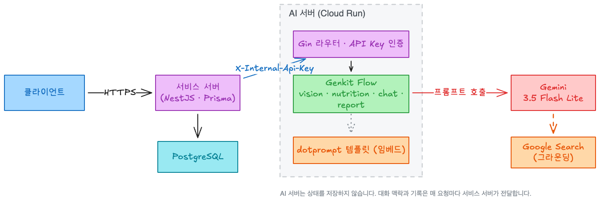
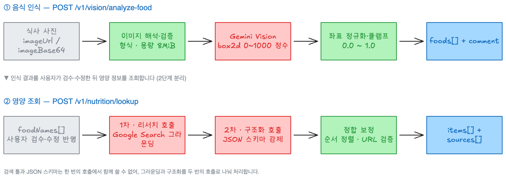
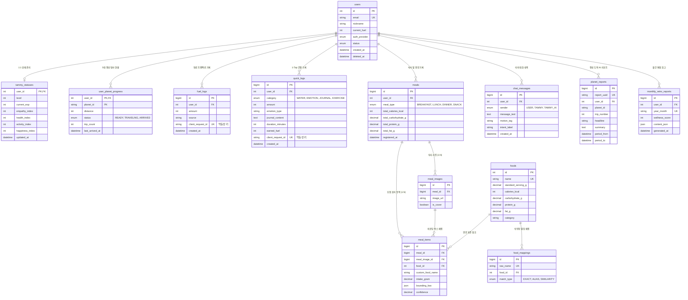

# 프로젝트 기획 보고서: 타미(Tammy)
### AI 웰니스 펫과 함께하는 바이오리듬 게이미피케이션 헬스케어 플랫폼

---

## Ⅰ. 문제 정의 및 사용자 분석

### 1. 배경 및 문제 정의
- **추진 배경 및 기획 동기**:
  - 현대인의 불규칙한 생활 패턴(식습관 불균형, 수분 섭취 부족, 만성 스트레스, 수면 및 운동 부족)으로 인한 대사 질환 위험이 지속적으로 증가하고 있습니다.
  - 내분비내과 전문의 우창윤의 저서 《살찌지 않는 몸》[^8]에 따르면, 비만과 대사 불균형은 개인의 의지 박약이나 나태함의 문제가 아니라, 초가공식품과 만성 스트레스, 수면 붕괴로 인해 체중 기준점인 '세트포인트(Set-point)'와 호르몬 항상성이 무너진 구조적 대사 질환입니다.
  - 그러나 기존 헬스케어 서비스들은 사용자의 칼로리 섭취량과 운동량을 숫자로 엄격히 감시하고 결핍을 경고하는 '처벌적 기록 방식'에 머물러 있습니다. 이러한 강박적 통제는 사용자에게 실패감과 죄책감(Guilt)을 안겨주어 스트레스 호르몬(코르티솔) 분비를 촉진하고, 결과적으로 감정적 폭식과 서비스 이탈(30일 이탈률 90% 이상[^1][^7])이라는 역효과를 초래합니다.
  - 또한 헬스 앱 설치자의 45.7%는 "과도한 데이터 입력 시간과 노력(High Data Entry Burden)"을 주된 이탈 원인으로 꼽았습니다[^2].
- **해결하고자 하는 핵심 문제**:
  - **기록의 높은 진입 장벽**: 매 끼니마다 칼로리와 무게를 일일이 검색하고 수동 입력해야 하는 번거로움[^3].
  - **칼로리 강박과 부정적 넛지(Negative Nudges)**: 단순 수치형 칼로리 트래킹 앱 사용자의 73%가 식단 기록 시 강박, 죄책감, 수치심 등 부정적 심리를 경험합니다[^4].
  - **지속 동기부여 결여 및 파편화된 관리**: 정서적 보상 없이 수치만 나열되며 식단, 수분, 감정, 운동이 분리되어 있어 통합적인 라이프스타일 회고가 불가능함.
- **기존 솔루션의 한계점**:
  - 상용 다이어트/헬스케어 앱은 비난이나 결핍 경고 중심의 딱딱한 UI로 사용자에게 심리적 압박감을 부여합니다.
  - 일반 LLM 챗봇은 사용자의 누적된 일상 기록 컨텍스트가 결여되어 일회성 조언에 그칩니다.

### 2. 타겟 사용자 분석 (Target Persona)
- **주 타겟 사용자층 (Primary Persona: 2030 바쁜 현대인 및 1인 가구)**:
  - **인구통계학적 특성**: 20대~30대 직장인, 대학생 등 불규칙한 생활 리듬을 가진 1인 가구.
  - **주요 불편 사항 (Pain Points)**:
    - 매번 음식 무게와 성분을 찾아 입력할 시간이 없고 귀찮음.
    - 혼자서 건강 관리를 지속하기 어렵고 쉽게 작심삼일에 빠짐.
    - 다이어트 실패나 불규칙한 일상으로 인해 자책감과 스트레스가 누적됨.
  - **핵심 요구사항 (Needs)**:
    - 사진 한 장, 원탭(1-Tap) 터치로 끝나는 초간편 기록 인터페이스.
    - 비난이나 강요 대신 따뜻한 공감과 지지를 보내주는 정서적 동반자.
    - 일상 기록이 즉각적인 성취와 재미(성장/보상)로 이어지는 게이미피케이션 경험.
- **부 타겟 사용자층 (Secondary Persona: 정서적 멘탈 케어 및 라이프스타일 개선 희망자)**:
  - 감정 기복이 심하거나 만성 피로를 겪으며, 텍스트 일기 작성 및 감정 회고를 통해 심리적 안정과 건강한 루틴을 함께 회복하고자 하는 사용자.

### 3. 시장 및 차별성 분석
- **시장 현황 및 기회 요인**:
  - 디지털 헬스케어 시장이 '통제/치료' 중심에서 '예방/정서적 웰니스(Mental + Physical Wellness)'로 패러다임이 전환되고 있습니다.
  - 다마고치 효과(Tamagotchi Effect) 및 가상 동반자(Virtual Companion) 모델은 외재적 기록 노력을 내재적 애착 동기로 전환시켜 사용자 순응도를 비약적으로 향상시킵니다[^5][^6].
- **경쟁 서비스 대비 핵심 차별점 (USP - Unique Selling Point)**:
  - **'3M(Meal · Mobility · Mentation)' 대사 회복 철학의 시스템화**: 《살찌지 않는 몸》[^8]의 핵심 원칙을 반영하여, 식사(Meal)의 혈당 안정, 일상 속 미세 활동(Mobility), 그리고 스트레스 조절 및 마음 관리(Mentation)를 시스템 전반에 유기적으로 구현.
  - **하이브리드 비전 AI (Zero-Cost Local ONNX + Cloud Multimodal LLM)**: 서비스 서버 내장 YOLOv8 모델로 즉각적인 음식 검출 및 식약처 DB 매핑을 수행하여 초저지연·비용 $0을 달성하고, 복합 식단은 Gemini 비전으로 보완.
  - **별여행 2-게이지 게이미피케이션 (Star Travel Engine)**: 일상 웰니스 행동이 '우주선 연료(Fuel)'와 '5대 행성 탐사 거리(Distance)'로 직결되어, 결핍에 대한 벌칙 대신 앞으로 나아가는 긍정적 보상(Positive Reinforcement) 루프 제공.
  - **공감형 픽셀 펫 '타미(Tammy)'**: 텍스트 대화 속 감정 상태(HAPPY, SAD, ANGRY, STRESSED, CALM)를 실시간 분석하여 6종의 맞춤 반응 모션과 '자기 자비(Self-Compassion)' 기반의 무비판적 공감 피드백 제공.

---

## Ⅱ. 기술 스택 선정

### 1. 기술 스택 요약

| 영역 | 기술 / 라이브러리 | 버전 | 선정 사유 |
| :--- | :--- | :--- | :--- |
| **Frontend Framework** | React, TypeScript, Vite | React 18, TS 5.x | 컴포넌트 기반 UI 개발 및 고속 HMR 개발 환경 구축, 엄격한 도메인 타입 안정성 |
| **Frontend Styling & Motion** | Tailwind CSS, Framer Motion | Tailwind 3.x, Framer 11.x | 픽셀 아트 테마 및 반응형 디자인, 우주선 스프링 및 워프 도착 인터랙션 구현 |
| **Service Backend** | Node.js, Express, TypeScript | Node 20+, Express 5, TS 5.x | 비동기 I/O 기반 고성능 API 서빙, TypeDI를 통한 계층형 아키텍처(IoC/DI) 구축 |
| **API Specification & Docs** | TSOA, Swagger UI | TSOA 6.x, OpenAPI 3.0 | TypeScript 인터페이스로부터 OpenAPI 스펙 및 Swagger UI 자동 동기화로 협업 효율 극대화 |
| **Database & ORM** | MySQL 8.0, Prisma ORM | Prisma 7.x | 완전한 타입 안전성(Type-safe Query), 마이그레이션 자동화, 식약처 표준 영양 DB 1.5만 건 서치 |
| **Local AI Engine** | ONNX Runtime Node, Sharp | onnxruntime-node 1.17+, Sharp 0.33+ | 서비스 서버 내장 YOLOv8 로컬 추론으로 네트워크 레이턴시 0ms 및 Zero-Cost 음식 Bounding Box 검출 |
| **Cloud AI Server** | Go, Gin, Google Genkit | Go 1.25, Gin 1.10, Genkit for Go | 고동시성/저지연 경량 마이크로서비스, Gemini 3.5 Flash Lite 및 dotprompt 기반 리포트/챗 파이프라인 |
| **Infra & DevOps** | GCP Cloud Run, Docker, Winston | Cloud Run (Serverless) | AI 서버의 무상태(Stateless) 오토스케일링 배포, Winston 및 AsyncLocalStorage 기반 요청별 분산 추적(Correlation-ID) |

### 2. 세부 선정 근거

#### 2.1 클라이언트 및 서비스 서버
- **클라이언트 아키텍처**:
  - React와 Tailwind CSS를 활용해 모바일 웹 환경에 최적화된 1-Tap UI를 구축했습니다.
  - Framer Motion을 도입해 우주선 이동 및 워프 애니메이션, 픽셀 타미 상호작용 피드백을 부드럽게 구현했습니다.
- **서비스 서버 계층 구조**:
  - Express 기반에 TSOA와 TypeDI를 도입하여 Controller-Service-Repository 3계층 아키텍처를 완성하고, DTO 변환(`BaseMapper`)과 데이터 접근(`BaseRepository`)을 엄격히 격리했습니다.
  - Prisma ORM을 통해 `users`, `meals`, `quick_logs`, `user_planet_progress`, `fuel_logs` 등 핵심 도메인 엔티티 간 관계를 무결하게 관리합니다.
  - 멱등성 키(`clientRequestId`)를 도입하여 불안정한 모바일 네트워크 환경에서도 중복 연료 적립을 방지하는 감사 로그 시스템을 구현했습니다.

#### 2.2 AI 서버 및 하이브리드 파이프라인
- **Go / Gin**: 프롬프트를 `//go:embed`로 바이너리에 포함해 배포물이 정적 바이너리 하나(distroless, non-root, 약 57MB)입니다. 요청 대부분이 모델 I/O 대기이므로 고루틴 동시성이 우수하며 콜드 스타트가 짧습니다.
- **Genkit + dotprompt**: `temperature`, `topP`, `maxOutputTokens`, 출력 스키마를 프롬프트 파일 frontmatter에 선언합니다. 프롬프트 수정이 코드 수정과 분리되고, 기동 시점에 전체 프롬프트 9종이 전수 검증됩니다.
- **Gemini 3.5 Flash Lite**: 이미지 인식, 검색 그라운딩, 긴 리포트 입력을 한 모델로 처리하면서 응답이 2~9초 수준입니다. 엔드포인트별로 `VISION_MODEL` / `CHAT_MODEL` / `REPORT_MODEL` / `RESEARCH_MODEL` 환경 변수를 두어 필요한 기능만 상위 모델로 교체할 수 있게 했습니다.
- **하이브리드 비용 최적화**: 일상적인 단일 음식 촬영 시에는 서비스 서버의 **ONNX Runtime(YOLOv8)**이 즉시 로컬에서 객체를 검출하고 식약처 공공데이터 15,000건과 매핑하여 API 비용을 $0으로 절감합니다. 고난도 다품종 한정식이나 심층 리포트 및 대화형 챗봇은 **Go + Genkit 기반 Cloud Run AI 서버**로 분기 처리합니다.

---

## Ⅲ. 요구사항 분석

### 1. 기능적 요구사항 (Functional Requirements)

- **[FR-01] 하이브리드 비전 기반 식단 스캔 및 영양 분석**:
  - 일상 사진은 로컬 ONNX YOLOv8 엔진이 바운딩 박스를 즉시 감지하고 식약처 DB와 매핑합니다. 복합 식단 및 예외 상황은 Cloud AI 서버(`/v1/vision/analyze-food`)로 자동 폴백되어 다품종 음식 인식 및 웹 검색 기반 영양 정보 조회(`/v1/nutrition/lookup`)를 수행합니다.
- **[FR-02] 2-게이지(Two-Gauge) 별여행 게이미피케이션 엔진**:
  - 전역 연료(Fuel, 0~100)와 5대 행성별 남은 거리(Distance, 100~0)를 관리하며, 웰니스 활동 시 연료 충전 및 거리를 단축합니다. 완주 시 워프 연출과 함께 AI 리포트를 해금합니다.
- **[FR-03] 1-Tap 퀵 로그 (Quick-Log) 시스템**:
  - 물 섭취(WATER), 감정 상태(EMOTION), 한 줄 감정일기(JOURNAL), 운동 시간(EXERCISE)을 모바일 최적화 원탭 버튼으로 3초 이내에 기록합니다.
- **[FR-04] 공감형 픽셀 펫 '타미(Tammy)' 대화 및 감정 모션 동기화**:
  - 텍스트 대화 속 감정을 5단계(HAPPY, SAD, ANGRY, STRESSED, CALM)로 실시간 분석하여 6종의 타미 반응 모션(PAT_PAT_HEAD, HUG, CHEER_UP 등)과 공감 답변을 출력합니다.
- **[FR-05] 5대 영역별 AI 심층 회고 리포트 생성**:
  - 식습관, 수분, 마음챙김, 생활습관, 장기회고에 대해 AI 서버가 누적 데이터를 분석하여 서사적 피드백과 실천 권장사항을 담은 마크다운 리포트를 생성합니다.
- **[FR-06] 운동 세트 타이머 및 1-Tap 운동 퀵로그 연동**:
  - 클라이언트 운동 타이머 완료 또는 직접 입력을 통해 `EXERCISE` 퀵로그를 서비스 서버로 전송하여 연료(+10 Fuel) 충전 및 생활습관 행성 거리를 -10 단축합니다.

### 2. 비기능적 요구사항 (Non-Functional Requirements)

- **성능 (Performance)**:
  - 로컬 ONNX 기반 단일 음식 비전 분석 응답 속도 500ms 이내 보장.
  - AI 서버 실측 기준 대화 약 2초, 음식 인식 5~8초, 영양 조회 약 9초(모델 2회 호출), 리포트 3~6초 완료.
  - HTTP 요청 타임아웃 120초, Cloud Run 인프라 타임아웃 300초 설정.
- **확장성 및 동시성 (Scalability & Concurrency)**:
  - 서비스 서버: 비동기 작업 큐(`AsyncQueue`)를 도입하여 메인 이벤트 루프 블로킹 방지.
  - AI 서버: 상태를 저장하지 않아(Stateless) 인스턴스 수평 확장이 용이하며, 인스턴스당 동시 요청 40 설정.
- **안정성 및 신뢰성 (Reliability & Idempotency)**:
  - `clientRequestId` 기반의 멱등성을 전역 적용하여 네트워크 재시도 시 중복 보상 차단.
  - 기동 시 프롬프트 9종 전수 검증, SIGTERM 수신 시 30초 Graceful Shutdown, 패닉 500 복구.
  - AI 모델 오류(502)와 타임아웃(504)을 명확히 구분하여 서비스 서버 폴백 안전망 가동.
- **보안 및 규정 준수 (Security & Compliance)**:
  - Bearer JWT 무상태 인증 및 15분당 100회 요청 제한(Rate Limit) 적용.
  - 서비스 서버 ↔ AI 서버 통신 시 `X-Internal-Api-Key` 인증 강제.
  - 감정일기 본문 및 개인 식별자(`userId`, `diaryId`)는 시스템 로그 및 AI 프롬프트에서 마스킹/제외.

---

## Ⅳ. 서비스 설계

### 1. 시스템 아키텍처 (System Architecture)

- **3-Tier 마이크로서비스 구조**:
  1. **클라이언트**: React 18 + TypeScript + Vite + Tailwind CSS + Framer Motion
  2. **서비스 서버**: Node.js + Express + Prisma 7 + MySQL 8.0 + ONNX Runtime (YOLOv8) + 식약처 DB 1.5만 건
  3. **AI 서버**: Go 1.25 + Gin + Google Genkit for Go + Gemini 3.5 Flash Lite (GCP Cloud Run)
- 클라이언트는 AI 서버를 직접 호출하지 않으며, 서비스 서버가 `X-Internal-Api-Key` 헤더를 붙여 내부 통신합니다.
- AI 서버는 DB에 직접 접근하지 않고 필요한 컨텍스트를 요청 본문으로 전달받아 처리하는 완전한 무상태(Stateless) 구조입니다.

### 2. 핵심 사용자 흐름 (User Flow / User Journey)

- **Step 1 (기록)**: 음식 사진 촬영(Food Scan) 또는 1-Tap 물/감정/운동 기록.
- **Step 2 (판별 & 보상)**: ONNX 즉시 검출 및 식약처 DB 매핑(예외 시 Cloud AI 비전/영양 파이프라인 가동) → Fuel +10 충전 및 행성 거리 감소 → 픽셀 타미 리액션 & 보상 토스트.
- **Step 3 (탐사 워프)**: Fuel 100 & Distance 0 달성 시 출발(Depart) 버튼 활성화 → 워프 애니메이션 → 행성 도착(Arrive) 완료.
- **Step 4 (리포트 회고)**: 도착 행성의 AI 심층 분석 리포트 확인 및 타미와의 공감 대화.

#### 음식 인식 및 영양 조회 파이프라인
식사 기록 흐름은 **인식과 영양 조회를 2단계로 분리**하여 사용자가 인식 결과를 수정한 뒤 정확한 영양 조회를 수행할 수 있도록 설계했습니다.

### 3. 주요 비즈니스 로직 및 정책

#### 3.1 3M 기반 게이미피케이션 정책
- **'3M' 기반 2-게이지 밸런스 정책**:
  - Meal(식사), Mobility(운동/활동), Mentation(수분/감정) 등 일상 속 3M 실천 10~20회 시 정확히 1개 행성 완주 및 100 Fuel이 충전되도록 설계.
- **출발/도착 상태 전이**:
  - `READY` → `TRAVELING` (100 Fuel 즉시 차감, 워프 중 남긴 기록은 차기 사이클 적립) → `ARRIVED` (거리 100 리셋 및 리포트 비동기 생성).

#### 3.2 AI 및 데이터 처리 정책

| 정책 | 내용 |
| :--- | :--- |
| 바운딩 박스 변환 | 모델에서는 Gemini 네이티브 형식(`[ymin, xmin, ymax, xmax]`, 0~1000)으로 받고, 서버가 0.0~1.0 정규화 좌표로 변환·클램프합니다 |
| 감정 값 보정 | `state`가 서비스 서버 enum 밖이면 `CALM`으로, `motionType`이 목록 밖이면 감정별 기본 모션으로 보정합니다 |
| 영양 응답 정합 | 요청한 음식명과 **같은 순서, 같은 개수**로 맞춥니다. 검색으로 확인하지 못한 음식은 수치 `0`, `confidence` `0`으로 채웁니다 |
| 출처 검증 | 절대 URL로 파싱되지 않는 출처는 버립니다. 모델이 지어낸 참조를 차단합니다 |
| 인식 실패 일관성 | 모델이 성공을 주장하면서 빈 배열을 준 경우 `isIdentified`를 `false`로 되돌려 서비스 서버 폴백이 정상 동작하게 합니다 |
| 컨텍스트 상한 | 대화는 최근 30턴, 장기 회고는 최근 400턴까지만 모델에 전달합니다 |
| 기록 밀도 (`dataDensity`) | `thin` / `normal` / `rich`에 따라 서사 톤만 조정하며, 생략 시 프롬프트 길이를 최소화합니다 |
| 민감 정보 보호 | 감정일기 본문은 로그에 남기지 않고, `diaryId`/`userId`는 모델에 전달하지 않습니다 |

---

## Ⅴ. 화면 설계

### 1. 정보 구조도 (Information Architecture)
- **홈 (`Home.tsx`)**: `SpaceStrip` 미니 우주선 게이지, 타미 픽셀 상호작용 뷰, 1-Tap 퀵로그 바, 일일 칼로리/영양 요약 카드.
- **식단 스캔 (`Food.tsx`)**: 카메라/갤러리 업로드, Bounding Box 오버레이, 식약처 영양성분 자동 계산 및 식사 확정 모달.
- **타미 챗 (`Chat.tsx`)**: 1:1 대화 피드, 텍스트 채팅창, 감정 뱃지 및 타미 반응 모션 동기화.
- **운동 타이머 및 기록 (`Exercise.tsx`)**: 운동 루틴 가이드, 인터벌 타이머, 완료 시 퀵로그 연동 및 연료 충전.
- **별여행 & 리포트 (`Travel.tsx`, `PlanetReport.tsx`)**: 5대 행성 탐사 맵, 워프/도착 연출, 서사형 AI 리포트 뷰어.
- **감정 일기 & 마이페이지 (`Diary.tsx`, `Growth.tsx`, `My.tsx`)**: 감정 캘린더, 한 줄 일기, 타미 레벨/EXP 로그, 프로필 관리.

### 2. 주요 화면 목록 및 기능 설명
- **화면 1 (홈 대시보드)**: 우주선이 스프링 물리 애니메이션으로 전진하며 연료 충전율을 직관적으로 표현.
- **화면 2 (하이브리드 식단 스캔)**: 업로드 즉시 로컬 ONNX 모델이 음식 영역에 사각 박스를 표시하고 식약처 DB와 매핑.
- **화면 3 (공감 대화)**: 사용자의 텍스트 입력에서 감정(HAPPY, SAD, ANGRY 등)을 감지하여 타미 스프라이트가 동적으로 리액션.
- **화면 4 (별여행 리포트)**: 행성 도착 시 축하 연출과 함께 Gemini가 생성한 스토리텔링 형식의 심층 회고 리포트 노출.

---

## Ⅵ. 데이터 및 API 설계

### 1. 데이터 모델링 (ERD / 스키마)

#### 1.1 서비스 서버 영속 데이터 모델 (Prisma Schema)

- **주요 엔티티 설명**:
  - `users`: 계정, 인증 제공자, 전역 잔여 연료(`current_fuel`), 소프트 딜리트(`deleted_at`).
  - `tammy_statuses`: 타미 레벨, EXP, 공감/건강/활동/행복 지수 (1:1).
  - `user_planet_progress`: 5대 행성별 상태(`READY`, `TRAVELING`, `ARRIVED`), 남은 거리(`distance`), 탐사 횟수.
  - `fuel_logs`: 연료 적립/차감 내역 및 `client_request_id` (멱등성 보장).
  - `meals`, `meal_items`, `meal_images`: 식사 기록, 영양소 총합, 음식별 Bounding Box(JSON) 및 신뢰도.
  - `foods`, `food_mappings`: 식약처 표준 영양 DB 15,000건 및 별칭 매핑.
  - `quick_logs`: 1-Tap 수분, 감정, 일기, 운동(`EXERCISE`) 기록.
  - `planet_reports`, `monthly_retro_reports`: 행성별 및 월간 AI 심층 리포트(JSON).
  - `chat_messages`: 대화 내역, 감정 라벨, 모션 태그(`motion_tag`).

#### 1.2 AI 서버 계약 모델 (Stateless DTO)
AI 서버는 저장소를 갖지 않으며 DTO가 공개 계약입니다. 감정 상태(`HAPPY`, `SAD`, `ANGRY`, `STRESSED`, `CALM`)는 서비스 서버 Prisma `EmotionState` enum과 100% 일치하도록 보정되어 전달됩니다.

### 2. 핵심 API 명세 (API Specification)

#### 2.1 서비스 서버 외부 API (Client ↔ Service Server)
- `POST /api/v1/auth/login`, `POST /api/v1/auth/signup`: JWT 무상태 인증
- `GET /api/v1/users/me`: 내 프로필 및 타미/연료 상태 조회
- `POST /api/v1/food-vision/scan`: 이미지 업로드 → ONNX 로컬 음식 검출 + 식약처 DB 영양성분 반환
- `POST /api/v1/food-log/confirm`: 식사 기록 확정 (연료 +10 적립 및 식사 행성 거리 단축)
- `POST /api/v1/quick-log`: 물/감정/일기/운동 1-Tap 기록 (`clientRequestId` 멱등성 검증, 연료 +10 적립)
- `GET /api/v1/planet-travel/state`: 5대 행성 탐사 현황 및 연료 잔액 조회
- `POST /api/v1/planet-travel/start`: 행성 탐사 출발/도착 처리 (연료 100 소모, AI 리포트 비동기 트리거)
- `GET /api/v1/travel-results/{id}`: 탐사 완료 행성의 AI 심층 리포트 조회
- `POST /api/v1/chat/messages`: 타미 대화 전송 및 감정 모션 수신

#### 2.2 AI 서버 내부 API (Service Server ↔ AI Server)
모든 `/v1` 엔드포인트는 `X-Internal-Api-Key` 헤더를 요구합니다.

| Method | Path | 설명 |
| :--- | :--- | :--- |
| POST | `/v1/vision/analyze-food` | 이미지에서 음식 인식 + 바운딩 박스 |
| POST | `/v1/nutrition/lookup` | 음식명 배열 → 영양 정보 + 출처 (웹 검색 그라운딩) |
| POST | `/v1/chat/process` | 타미 대화 + 사용자 감정 분석 |
| POST | `/v1/reports/diet` \| `/mindfulness` \| `/lifestyle` \| `/hydration` \| `/retrospective` | 리포트 5종 (`title` / `markdown` / `nextActionChecks` 공통 응답) |
| GET | `/health` | 헬스 체크 (인증 불필요) |

#### 2.3 에러 계약
모든 비즈니스 에러는 `{ "code": ..., "message": ... }` 표준 규격으로 반환됩니다.

| Code | Status | Code | Status |
| :--- | :--- | :--- | :--- |
| `INVALID_REQUEST` | 400 | `UNSUPPORTED_IMAGE_TYPE` | 415 |
| `IMAGE_REQUIRED` | 400 | `AI_MODEL_ERROR` | 502 |
| `UNAUTHORIZED` | 401 | `IMAGE_FETCH_FAILED` | 502 |
| `IMAGE_TOO_LARGE` | 413 | `AI_MODEL_TIMEOUT` | 504 |

---

## Ⅶ. AI 기능 설계

### 1. AI 기능 정의 및 목적
- **설계 철학 ('3M' 대사 회복 통합 케어)**:
  - 타미의 AI 에이전트는 단순 챗봇이 아닌, 《살찌지 않는 몸》[^8]의 **3M(Meal · Mobility · Mentation)** 의학적 철학을 계승하여 **식습관(Nutrition), 운동/활동(Exercise), 수면/생활리듬(Lifestyle), 정신건강(Mindfulness/Emotion)** 영역을 전인적으로 케어합니다.
- **4대 AI 기능 구성**:

| 기능 | 해결 과제 |
| :--- | :--- |
| **비전** | 사진 한 장에서 여러 음식을 분리해 인식하고, 화면에 표시할 바운딩 박스 좌표를 함께 제공합니다 |
| **영양 리서치** | 모델 기억이 아닌 **웹 검색으로 확인된** 영양 수치와 출처 URL을 제공합니다 |
| **대화** | 공감형 페르소나 응답과 사용자 감정 분석을 1회의 호출로 일괄 처리합니다 |
| **리포트** | 단순 통계 수치가 아닌 원시 활동 로그를 받아 맥락 중심의 내러티브 회고를 생성합니다 |

### 2. AI 모델 및 파이프라인 설계

#### 2.1 하이브리드 비전 2-Tier 파이프라인
- **Tier 1 (로컬 고속 엔터프라이즈 추론 - Zero-Cost & 0ms Latency)**:
  - `Sharp`로 이미지 전처리 후 서비스 서버 내장 `YOLOv8-Food`(`best.onnx`) 모델을 구동하여 300~500ms 이내에 바운딩 박스를 검출합니다.
  - 식약처 국가 표준 영양 DB 15,000건과 3단계(Exact → Alias → Levenshtein)로 매핑합니다.
- **Tier 2 (클라우드 생성 엔진 폴백 - 복합 식단 및 예외 특화)**:
  - 로컬 신뢰도가 0.6 미만이거나 40품목 이상의 상차림일 때 AI 서버 `/v1/vision/analyze-food`로 폴백합니다.
  - 희귀 음식은 Google Search Grounding 기반의 `/v1/nutrition/lookup`을 통해 정확한 영양 정보를 검색·구조화합니다.

#### 2.2 프롬프트 엔지니어링 및 하이퍼파라미터
dotprompt 9개와 공용 partial 2개(`_persona`, `_report_rules`)로 구성하여 일관된 말투와 서술 규칙을 유지합니다.

| 프롬프트 | temperature | 의도 |
| :--- | :--- | :--- |
| `chat` | 0.85 | 대화는 매번 다채롭고 생동감 있게 반응 |
| `report_*` | 0.7 | 따뜻한 서술을 유지하면서도 일관된 리포트 규칙 준수 |
| `vision_food` | 0.2 | 좌표와 음식명의 안정적 검출 |
| `nutrition_research` | 0.1 | 검색 결과에 충실한 영양 데이터 추출 |
| `nutrition_structure` | 0 | 결정적이고 엄격한 JSON 파싱 |

#### 2.3 공감형 대화 및 프라이버시 엔지니어링
- **자기 자비(Self-Compassion) 페르소나 (`_persona.prompt`)**:
  - 타미는 엄격한 트레이너가 아닌 따뜻한 픽셀 친구로서, 칼로리 초과나 목표 미달에 대해 비난하거나 죄책감을 주지 않고 정서적 지지와 긍정적 강화를 제공합니다.
- **실시간 감정 분석 및 스프라이트 모션 매핑**:
  - 5대 감정(`HAPPY`, `SAD`, `ANGRY`, `STRESSED`, `CALM`)을 감지하여 6종의 타미 모션 태그(`PAT_PAT_HEAD`, `JUMP_JOY`, `HUG`, `NOD_SLOWLY`, `CHEER_UP`, `SIT_BESIDE`)를 클라이언트 애니메이션과 동기화합니다.
- **개인정보 보호 및 식별자 은닉**:
  - 감정일기 본문은 AI 서버 로그에 남기지 않으며, `diaryId`/`userId` 등 시스템 식별자는 프롬프트 주입 단계에서 원천 제거합니다.

#### 2.4 데이터 밀도(Data Density) 적응형 5대 웰니스 서사 리포팅
- **3단계 데이터 밀도 적응형 프롬프트 (`dataDensity`)**:
  - `thin` (기록 5개 미만): 짧지만 시작의 가치를 격려하는 압축적 스토리텔링.
  - `normal` (기록 5~20개): 주간 패턴과 루틴 형성의 흐름을 균형 있게 조명.
  - `rich` (기록 20개 초과): 풍부한 데이터를 바탕으로 세부 상관관계를 심층 분석.
- **3대 감정 입력 스트림 가중치 정책**:
  - `emotionRecords` (원탭 퀵로그): 전반적 감정 분포 파악 (낮은 가중치).
  - `chatLogs` (대화 내역): 일상 맥락 파악 (중간 가중치).
  - `diaries` (감정 일기): **가장 높은 가중치 부여.** 리포트의 핵심 중심축으로 심리적 배경 전개.

### 3. 예외 및 Fallback 전략

| 위험 | 대책 |
| :--- | :--- |
| **스키마 이탈** | 출력 스키마를 모델 단에서 강제하고, 디코드 실패는 502로 변환하며 본문은 로그에 남기지 않습니다 |
| **출력 잘림** | 상차림 다품종 처리를 위해 비전 프롬프트의 `maxOutputTokens`를 8192로 설정했습니다 |
| **환각 (Hallucination)** | 절대 URL 출처 검증, 요청 순서 정렬, enum 보정, 미확인 항목 `confidence: 0` 처리로 방어합니다 |
| **응답 지연** | 타임아웃을 `AI_MODEL_TIMEOUT`(504)으로 구분하여 서비스 서버의 적절한 재시도 및 폴백을 유도합니다 |
| **인식 실패** | `isIdentified: false` 및 빈 배열을 반환하여 클라이언트 재촬영·수동 입력 폴백으로 전환합니다 |
| **안전성 (Safety)** | 페르소나 규칙에서 의학적 진단, 타 사용자와의 비교, 강박적 칼로리 경고를 금지하고, 위험 신호 시 전문가 상담을 안내합니다 |

---

## Ⅷ. 개발 환경 및 협업 방식

### 1. 개발 환경 설정

- **기본 환경**: Node.js v20+, Go 1.25, MySQL 8.0, Docker 24+
- **패키지 관리**: `npm` (클라이언트 및 서비스 서버), `go modules` (AI 서버)
- **실행 및 빌드 스크립트**:

| 영역 | 주요 실행 명령 | 설명 |
| :--- | :--- | :--- |
| **클라이언트** | `npm run dev` | Vite 기반 고속 HMR 개발 서버 구동 |
| **서비스 서버** | `npm run dev` | TSOA 컴파일 + Nodemon + Swagger 동기화 |
| **AI 서버** | `make run` / `make test` | Go Gin 서버 실행 (`debug` 모드) / race 검출 포함 테스트 |
| **AI 서버 빌드** | `make docs` / `make deploy` | Swagger 문서 재생성 / Cloud Run 배포 |

### 2. 협업 규칙 및 컨벤션

- **Git 브랜치 전략**: GitHub Flow 기반 (`main` 브랜치 및 `docs/*`, `feature/*`, `fix/*` 단기 기능 브랜치 운영).
- **커밋 메시지 규칙**: Conventional Commits 규격 준수 (`feat:`, `fix:`, `docs:`, `refactor:`, `test:`).
- **시스템 간 연동 계약**:
  - 서비스 서버 ↔ AI 서버 간 통신은 REST 계약으로만 결합하며, 변경 시 `SERVICE_INTEGRATION.md`를 통해 사전 조율합니다.
  - 프롬프트 수정 시 `go test ./internal/ai/ -run TestPrompts`를 실행해 frontmatter 오류와 partial 누락을 검증합니다.
  - Swagger 문서는 코드 선언 기반으로 자동 동기화합니다.

---

## Ⅸ. 보안 및 배포 계획

### 1. 보안 및 개인정보 보호

- **인증 및 인가**:
  - 서비스 서버: Bearer JWT 무상태 인증 및 TSOA 보안 미들웨어 적용.
  - AI 서버: 모든 `/v1` 엔드포인트에 `X-Internal-Api-Key` 상수 시간 비교 검증 강제 (프로덕션 환경 무인가 요청 차단).
- **네트워크 및 트래픽 방어**: `express-rate-limit` 적용 (15분당 100회 요청 제한).
- **입력 검증 및 파일 보안**: 이미지는 매직 바이트 판별로 JPEG/PNG/WebP/HEIC만 허용하며 8MiB 초과 시 거절.
- **데이터 보안 및 감사 로그**: Winston 커스텀 로거 기반 민감 정보 마스킹 및 `X-Correlation-Id` 분산 추적.

### 2. CI/CD 및 배포 계획

- **AI 서버**: `make deploy` 스크립트를 통한 GCP Cloud Run 무상태 컨테이너 자동 배포 (메모리 512Mi, 동시성 40, distroless non-root 이미지).
- **서비스 서버 & 클라이언트**: Dockerfile 기반 컨테이너 빌드 및 클라우드 호스팅 배포 파이프라인 구성.
- **시크릿 관리**: GCP Secret Manager 및 환경별 `.env` 분리(`development`, `production`, `test`).

### 3. 모니터링 및 운영 계획

- **헬스 체크**: 서비스 서버 `/health`, AI 서버 `/health` 엔드포인트를 통한 컨테이너 liveness 상태 주기적 점검.
- **구조화 로깅**: JSON 구조화 로깅을 채택하여 Cloud Logging 필드 검색 지원 및 헬스 체크 로그 제외 처리.
- **에러 트래킹**: 모든 비즈니스 예외를 정형화된 JSON 봉투(`ApiResponse<T>`)로 캡슐화하고 스택 트레이스 노출 방지.

---

## Ⅹ. 남은 과제

| 항목 | 상태 | 내용 |
| :--- | :--- | :--- |
| `motionType` 6종 허용 목록 | 진행 중 | AI 서버 측 제안 6종과 클라이언트 스프라이트 애니메이션 세트 간 최종 동기화 확정 |
| 서비스 서버 리포트 입력 | 진행 중 | 집계 스칼라(더미값)를 날짜별 원시 로그 조회 쿼리로 교체 완료 및 검증 |
| 장기 회고 리포트 비동기 큐 | 검토 중 | 서비스 서버의 작업 큐와 비동기 상태 저장을 통한 안정적 장기 리포트 파이프라인 고도화 |
| 영양 조회 캐싱 | 검토 중 | 외부 웹 검색 지연 해소를 위한 서비스 서버 `foods` 테이블 영양 데이터 캐싱 적용 |

---

## Ⅺ. 참고 문헌 및 각주 (References & Footnotes)

[^1]: Baumel, A., Muench, F., Edan, S., & Kane, J. M. (2019). Objective user engagement with mental health apps: Systematic search and panel-based usage analysis. *Journal of Medical Internet Research*, 21(9), e14567. https://doi.org/10.2196/14567
[^2]: Krebs, P., & Duncan, D. T. (2015). Health app use among US mobile phone owners: A national survey. *JMIR mHealth and uHealth*, 3(4), e101. https://doi.org/10.2196/mhealth.4924
[^3]: Cordeiro, F., Epstein, D. A., Thomaz, E., Bales, E., Jagannathan, A. K., Abowd, G. D., & Fogarty, J. (2015). Barriers and negative nudges: Exploring challenges in food journaling. In *Proceedings of the 33rd Annual ACM Conference on Human Factors in Computing Systems (CHI '15)*, 1159–1168. https://doi.org/10.1145/2702123.2702155
[^4]: Levinson, C. A., Fewell, L., & Brosof, L. C. (2017). My Fitness Pal calorie tracker usage in the eating disorders. *Eating Behaviors*, 27, 14–16. https://doi.org/10.1016/j.eatbeh.2017.08.003
[^5]: Lin, J. J., Mamykina, L., Lindtner, S., Delajoux, G., & Strub, H. B. (2006). Fish’n’Steps: Encouraging physical activity with an interactive computer game. In *International Conference on Ubiquitous Computing (UbiComp 2006)*, 261–278. Springer, Berlin, Heidelberg. https://doi.org/10.1007/11853565_16
[^6]: Fitzpatrick, K. K., Darcy, A., & Vierhile, M. (2017). Delivering cognitive behavior therapy to young adults with symptoms of depression and anxiety using a fully automated conversational agent: A randomized controlled trial. *JMIR Mental Health*, 4(2), e19. https://doi.org/10.2196/mental.7785
[^7]: Adjust & AppsFlyer. (2024-2026). *Mobile App Retention Benchmarks: Health & Fitness Category Reports*. https://www.adjust.com/resources/insights/
[^8]: 우창윤. (2026). *살찌지 않는 몸: 평생 가볍게 살아가는 4주 대사 회복 프로젝트*. 웅진지식하우스. (ISBN: 9788901287959)
